<p align="center">
<span style="font-size: 32px;">自己組織化論理
</span>
</p>                


<p align="center">
<span style="font-size: 24px;">進藤　啓介
</span>
</p>                
<p align="center">
SHINDO Keisuke
</p>                

<p align="center">
                kshindo999@gmail.com
</p>                
<p align="center">
Apr 5, 2025
</p>


## 概要

自己組織化論理は、確率によって順序回路を自動生成する論理回路動作シミュレータの理論体系であり、体系的で一般化された機械学習の理論である。第一の特徴は、ベイジアンネットワークを用いて双方向の確率伝搬を行う。第二の特徴は、ネットワークのノード間で二つの伝搬確率を用いて正確な論理回路を形成する。第三の特徴は、このネットワークに対して仮定ベクトルと呼ぶ活性値を伝搬させてネットワーク内部で比較と代入とを行う。第四の特徴は、ネットワークを必要に応じて部分複製して改変する。これらの要素を用いることで、この自己組織化論理は確率論的に最も正確に論理回路を生成できる。さらに、階層的な状態や状態遷移や自然言語さえも表現可能である。これらの結果、ソフトウェアの要素全てを自律生成することができると期待される。

Self-organizing logic is a theoretical system for a logic circuit operation simulator that automatically generates sequential circuits based on probability, and is a systematic and generalized machine learning theory. The first feature is to perform bidirectional probability propagation using a Bayesian network. The second feature is to form an accurate logic circuit using two propagation probabilities between the nodes of the network. The third feature is to propagate activation values ​​called assumption vectors to this network and perform comparisons and substitutions within the network. The fourth feature is to partially replicate and modify the network as necessary. By using these elements, this self-organizing logic can generate logic circuits with the most probabilistic accuracy. Furthermore, it is possible to express hierarchical states, state transitions, and even natural language. As a result, it is expected that all software elements can be generated autonomously.

## Keywords
 machine learning,bidirectional Bayesian network,sequencial circuit,state machine,natural language processing

<div style="page-break-after: always;"> </div>

# Contents

1. [自己組織化論理の構成要素](#1)　................................................... 5
1.1 [双方向論理演算](#1_1)
1.2 [双方向二項確率ベイジアンネットワーク](#1_2)
1.3 [仮定ベクトルと伝搬集合](#1_3)
1.4 [確率変動分配階層フィードバックアルゴリズム](#1_4)
1.5 [同時観測からの連想形成](#1_5)
1.6 [確率的自律論理生成アルゴリズム](#1_6)
1.7 [順序回路の自律生成](#1_7)

2. [双方向論理演算](#2)　........................................................... 23
2.2 [ノードとリンク](#2_2)
2.3 [リンク伝搬と論理演算](#2_3)
2.4 [リンクの縦分割と論理演算挿入](#2_4)

3. [写像](#3)　.................................................................... 29
3.1 [写像の定義](#3_1)
3.2 [逆伝搬と代入](#3_2)
3.3 [写像と序列](#3_3)
3.4 [序列と自然言語](#3_4)

4. [活性値の双方向伝搬](#4)　....................................................... 34
4.1 [活性値の伝搬の流れ](#4_1)
4.2 [仮定ベクトル](#4_2)
4.3 [活性値の確率伝播](#4_3)
4.4 [確率の逆伝搬](#4_4)
4.5 [活性値の衝突](#4_5)

5. [確率変動分配階層フィードバック](#5)　............................................ 38
5.1 [リンク上の二項組確率伝播](#5_1)
5.2 [双方向伝搬と論理演算の確率計算](#5_2)
5.3 [フィードバックの適用対象](#5_3)
5.4 [効果係数$E_n$の算出](#5_4)
5.5 [重み値$w_n$の式の導出](#5_5)
5.6 [確率補正値 $\Delta P_n$ の算出](#5_6)
5.7 [フィードバック分配とネットワーク複製](#5_7)
5.8 [フィードバック観測数$N$を用いたリンクの伝搬確率補正](#5_8)

6. [連想](#6)　.................................................................... 49
6.1 [連想対象選択](#6_1)
6.2 [連想形成と条件の付加](#6_2)
6.3 [伝搬確率、経験数の算出](#6_3)

7. [確率的自律論理生成アルゴリズム](#7)　............................................ 52
7.1 [「条件」リンク分割と論理演算ノード形成](#7_1)
7.2 [「因果」フィードバックからのリンクノード活性化](#7_2)
7.3 [「代入」伝搬集合的に包含関係にあるノード間の結合](#7_3)
7.4 [「インスタンス化」伝搬部分集合によるネットワークの一部のインスタンス複製](#7_4)
7.5 [ 「一般化」伝搬部分集合によるネットワークの一部の一般化複製](#7_5)
7.6 [「選択」多数のリンク伝搬の選択制御](#7_6)
7.7 [「収斂」リンクの最適化](#7_7)
7.8 [SOL全体動作](#7_8)

8. [順序回路生成](#8)　............................................................ 60
 8.1 [観測関数](#8_1)
 8.2 [時系列ステート生成](#8_2)
 8.3 [一般化ノードから関数生成](#8_3)
 8.4 [関数適用](#8_4)
 8.5 [関数のグループ化](#8_5)
 8.6 [組み込み関数とその利用](#8_6)
 8.7 [機械学習のAttentionとの対比](#8_7)

9. [結論](#9)　................................................................... 66


<div style="page-break-after: always;"> </div>
<a id="1"></a>

#  1.自己組織化論理の構成要素

<a id="1_1"></a>

## 1.1 双方向論理演算
### 1.1.1 古典的な順序回路

通常の論理代数では、AND、OR、NOTの論理演算の要素をノードとして持ち、それらをリンクで結合して、基本的な論理動作を行う。順序回路では、これにフリップフロップFF、あるいはメモリなどの記憶機能が追加される。CPU、GPUなどはすべてこの順序回路に該当する。この順序回路は任意の入力列に対して理論上あらゆる出力列を得ることができる。

<p align="center">

</P>
<p align="center">
図1 順序回路
</P>

### 1.1.2 論理回路の逆伝搬による写像

論理演算は、ベン図などで表現されるように集合を互いに切り貼りする作用があるが、下の図のXとYのように重複のない排他的な部分集合間では論理演算が出来ない。それに対して、写像は、入力された集合に対して排他的な別の集合に到達することを可能にする。そのためには、写像の前後の集合を、それらを包含するさらに大きな集合であるMapノードの部分集合とみなす。入力ノードXと出力ノードYとは、Mapノードに対してそれぞれdomain,codomainノードとANDを取る結果と等しくなる。

<p align="center">

</P>
<p align="center">
図2 基本的なベン図
</P>

写像元Xから写像先Yへの伝搬は、Mapノードへの逆伝搬で実現する。排他的なノードの間の確率伝搬を定義するために、AND1からMapへの逆伝搬では、domainの補集合の部分を補うことで集合を拡大する。Mapノードで拡大された集合はcodomainと集合的に排他的ではなくなるため、codomainとのAND論理演算が可能になる。こうして集合的に重複のないXからYへの伝搬を可能にする。

この写像ノードと逆伝搬を用いた連想リンクによって、状態遷移の記述を可能にする。さらに、この作用がフリップフロップやメモリなどの記憶素子と同じ挙動を、より一般化して実現する。例えば、メモリの読み出しは、時空間が異なる集合からの写像と見なすことができる。

<p align="center">

</P>
<p align="center">
図3 写像の集合表現
</P>

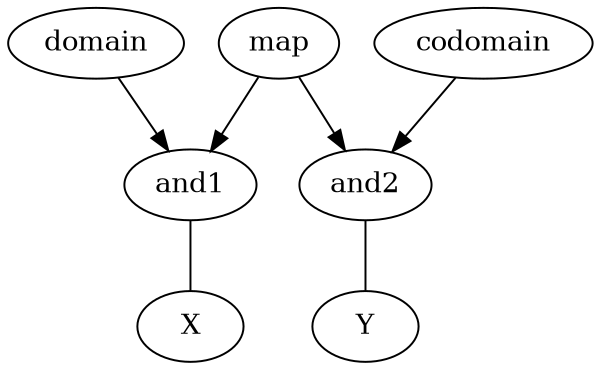
<p align="center">
図4 逆伝搬による写像の表現
</P>

<a id="1_2"></a>

## 1.2 双方向二項確率ベイジアンネットワーク

### 1.2.1 確率伝搬

論理ノード間の接続リンクに、それぞれ伝搬確率を与える。伝搬する論理値は1,0の二値であり、伝搬確率を0から1までの値で示す。

リンクの順方向は伝搬確率のペア $P^{f11}$,$P^{f00}$ で構成され、さらに逆方向の伝播確率もペア $P^{r11}$,$P^{r00}$ で構成される。

AからBへの伝搬リンクにおいて、A、Bそれぞれの確率値 $P(A)$,$P(B)$は、２つの伝搬確率 $P^{f11}$,$P^{f00}$ によって関連付けられる。

$$P(B)=P(A) P^{f11} +(1-P(A))(1-P^{f00})$$

値の反転であるNOT演算は、 $P^{f11}$ , $P^{f00}$ がそれぞれ０になる。NOTでない伝搬は、$P^{f11}$,$P^{f00}$ がそれぞれ１になる。論理演算も確率計算として定義され、複数の論理演算の入力確率 $P^{f11}_{1}$,$P^{f11}_{2}$,$P^{f11}_{3}$ を統合する。以下はANDの例である。

$$P'=P^{f11}_{1} P^{f11}_{2} P^{f11}_{3}...$$

これらの自明な確率計算を組み合わせることにより、任意の２つのノード間の論理演算の経路において、経路全体の伝搬確率が求まる。ニューラルネットワークと異なり、シグモイド関数などのしきい値関数などは一切使用しない。

### 1.2.2 逆方向伝搬
リンクの逆方向伝搬の確率について説明する。たとえば、以下のようなANDノードCが生成されたとする。

$$	C=A\land B $$

逆に、ノードCが確率１に活性化された場合は、ノードA,Bの伝搬確率１での活性化が可能になる。これが逆方向伝搬である。
$$	C \rightarrow B $$

逆方向伝搬により、２つの任意のノード間の伝搬が確実に可能になる。逆方向伝搬の確率 $P_r^{11}$,$P_r^{00}$ は、ベイズの定理を用いて算出される。P(A)をリンク元A、P(B)をリンク先Bの観測確率として、以下の式で求められる。

$$ P_{r}^{11}=\frac{P(A) P^{11}}{P(B)}$$

$$ P_{r}^{00}=\frac{(1-P(A)) P^{00}}{1-P(B)}$$

つまり、双方向確率伝搬は、ベイズの定理が自然な形で組み込まれている。論理演算に対する逆方向伝搬は、ANDノードへの値１の逆伝搬のように値がすべて確定する場合はすべての入力リンクに対して伝搬する。ANDノードへの値０の逆伝搬は入力リンクの伝搬確率が確定しないが、伝搬する入力リンクを１つだけ選択すれば、選択したリンクだけは確率が確定する。

<a id="1_3"></a>

## 1.3 仮定ベクトルと伝搬集合

SOLは、ネットワーク上に活性値を伝搬するが、伝搬する活性値は伝搬するリンクの断面のすべてを集合として占めるわけではなく、起点となる複数のノードの値によって断面の集合が分断されると考える。この伝搬集合はネットワーク上で通過する集合とは無関係であり、起点ノードの値の組み合わせによって決定される。そのため、複数の起点ノードの仮定値の組み合わせを「仮定ベクトル」と呼ぶことにする。伝搬集合の大きさはこの仮定ベクトルによって示される。以下、仮定ベクトル(Assumption Vector)は必要に応じて略して「AV」と表記する。

<p align="center">

</P>
<p align="center">
図5 仮定ベクトル
</P>

### 1.3.1 仮定ベクトルの合成

複数の仮定ベクトルは、論理演算によって合成された結果、双方の仮定ベクトル要素が合成された仮定ベクトルとなる。論理演算のANDでは確率１同士の合成の時に仮定ベクトルが合成される。論理演算のORでは確率０同士の合成のときに仮定ベクトルが合成される。論理演算のXORや、確率が０と１の間の中間値の合成の場合は無条件で仮定ベクトルが合成される。

- 仮定ベクトル間で異なる仮定ベクトル要素はそのまま合成される。
- 仮定ベクトル間で同一の仮定ベクトル要素は１つに集約される。
- 集合的に包含関係の仮定ベクトル要素との合成は伝搬集合的に小さい要素に取って代わる。
- 集合的に排他的な仮定ベクトル要素との合成は伝搬集合自体が空集合になる。

### 1.3.2 仮定ベクトルによる伝搬集合比較

この仮定ベクトルを用いて、複数の活性値の伝搬集合としての大きさを比較することが可能になる。この比較は、写像を通過した伝搬集合としての比較であり、実際の集合とは無関係である。

- 仮定ベクトルの仮定集合要素がすべて同一であれば、実際の集合にかかわらず双方の伝搬集合は同一である。
- 仮定ベクトルの仮定集合要素の非同一部分が片方のみであれば、双方の伝搬集合は包含関係になる。
- 仮定ベクトルの仮定集合要素の非同一部分が双方にあれば、双方の伝搬集合は無関係になるので連想の対象にならない。
- 仮定ベクトルの仮定集合要素の間に排他的な集合要素があれば、伝搬集合が消滅するので伝搬を停止する。

仮定ベクトルを利用した厳密な伝搬集合の管理により、2つのノード間の正確な連想リンクを形成できる。SOLのリンク形成は、すべてこの仮定ベクトルに従って選択されて実行される。

### 1.3.3 仮定集合と伝搬確率

複数の仮定ベクトルは互いの集合の包含関係を示す。仮定ベクトルの仮定集合の様々な組み合わせに対して、それぞれ伝搬確率が定められる。これによって仮定の全ての組み合わせに対して、ある事象が発生する確率がそれぞれ求められる。

<p align="center">

</P>
<p align="center">
図6 仮定集合と伝搬確率
</P>


### 1.3.4  写像逆伝搬と伝搬集合拡大

Bool値などを示すノードX,Yについて、ノードYからノードmapへと逆伝搬する際に、集合を拡大する作用を用いて、ノードmapへと活性値を伝搬するための方法について述べる。

<p align="center">

</P>
<p align="center">
図7 逆伝搬
</P>

上の図のように、ANDに対して出力Yから入力Xへと逆伝搬するということは、逆伝搬先のmapノード以外の値がともに確定していたとしても、逆伝搬の結果の値は確定しない。具体的には、ANDの入力値が0でかつANDの出力値が0であるならば、ANDから逆伝搬したmapノードの値は0と1のどちらでも矛盾はない。だから逆伝搬は伝搬集合を拡大する余地がある。


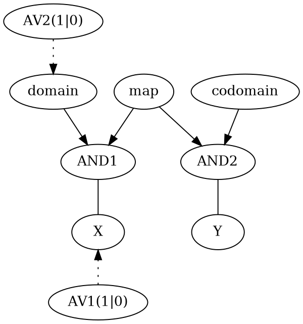

<p align="center">
図8 仮定ベクトルを用いた写像リンク伝搬
</P>

Xからmapへの逆伝搬を行う。AND1からmapへの逆伝搬の際に、集合domainの入力が別にある場合は、domainの補集合の拡大を行うことができる。Xから伝搬されるAV1も、domainから伝搬されるAV2も、値が相補的な２つの伝搬集合のペアであるとする。この場合、Xの伝搬集合がdomainの伝搬集合に一致するか完全に含まれる場合に、Xからの集合を拡大してmapに伝搬する。伝搬集合が拡大するとは、domainの相補的な仮定ベクトルAVの要素を合成して伝搬集合を拡大するということであり、仮定ベクトルAVの要素が１つ減るということでもある。

　仮定ベクトルの合成結果は伝搬集合が拡大されるので、確率は均一に１か０であるという可能性が高い。その理由は、mapで合成された伝搬集合は、AV1に仮定要素を追加する前の伝搬集合と同一である可能性が高いため、その確率もまた仮定要素を追加する前の伝搬集合と同じく均一の値であると推定されるためである。

　こうして、伝搬集合が拡大された状態でmapからAND2に伝搬され、codomainとANDを取る。この結果、Yへと拡大された伝搬集合が伝搬される。ここで、mapノードからAND2ノードへの弱いリンクは観測数が少なく確定していない状態である。弱いリンクはポジティブフィードバックによって強化される。その結果、mapでの集合の拡大の確率も同時に確定に近づく。

### 1.3.5 一般的な状態の表現

写像を用いれば、巨大な状態を以下のように表現することができる。部分状態X1,X2などはさらなる状態を階層的に接続できる。それぞれの状態をAddress等で分割して示すだけではなく、連続な時系列や座標を使用することも可能で、さらに他の写像からの写像先ノードや抽象的なノードを条件として使用することも可能になる。

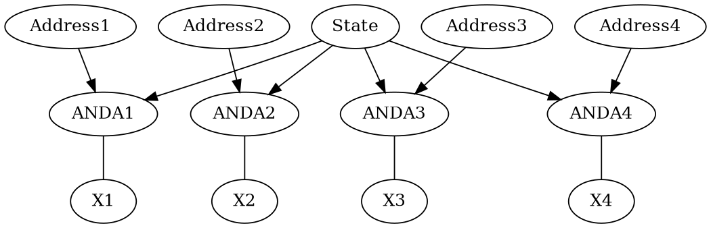

<p align="center">
図9 写像リンクによる多変数ステート
</P>

<a id="1_4"></a>

## 1.4 確率変動分配階層フィードバックアルゴリズム

SOLのネットワークを通過する伝搬確率と、外部観測関数で観測されたパスの伝搬確率との違いを解消して、観測された確率を再現すること。これがSOLにおける一般化された学習と考える。現存する通常のニューラルネットワークの学習と目的はほぼ同一だが、活性化関数のようなヒューリスティックスを用いずに、より厳密な方法で実現する。

### 1.4.1 確率伝搬と衝突とフィードバック

任意の共通の起点ノードから、ネットワークの複数のパスを通過して、もう一度別の同一のノードに到達することがある。例えば、過去に観測された結果のノードと、現在観測されている結果のノードとの衝突が典型例となる。

２つの経路それぞれの起点となる仮定ベクトルの集合に重複があれば衝突とみなす。衝突した双方の経路の伝搬確率が異なればフィードバックを行う。フィードバックの量を正確に計算するために、この確率変動分配階層フィードバックで確率計算を行い、フィードバックすべきリンクとその量を特定する

<p align="center">

</P>

<p align="center">
図10 ２つのパスの間の伝搬確率の差分
</P>

### 1.4.2 フィードバック値の算出

２つのパス全体の伝搬確率が観測されたときに、２つのパスの伝搬確率の違いが発生する。この違いを解消するために、それぞれのパスにフィードバックを行う。ここで問題になるのは、階層的なリンクでは、どのリンクにどの程度のフィードバックを作用させるかの判定が難しいという点である。この問題を、「確率変動分配階層フィードバック」アルゴリズムでは、より正確な手法で解決した。この手法は、理論上無制限の階層のリンクそれぞれに対して、確率論的に最適に近いフィードバックを、少ない計算オーダーで適切に与えることが可能になる。

基本的なコンセプトは、リンクnの確率の変動の発生確率が、リンクnの伝搬確率$P_n$と観測回数$N_n$にそれぞれ依存するところからスタートする。このリンクを複数通過した結果、全体伝搬確率$P_{total}$が観測されたとする。その全体伝搬確率の結果との相違が発生したら、その相違は、以下のようにそれぞれのリンクに対して、リンクごとのウェイト$w_n$に応じて分配されてフィードバックされる。リンクごとのウェイト$w_n$は以下の式で算出する（かなり厳密な導出に基づくがここでは省略する）。$P_n$はこれまで観測されたリンクの伝搬確率であり、$N_n$はこれまでフィードバックが適用された回数を示す。$E_n$は、各リンクの確率の変動が全体伝搬確率に作用するための効果係数であり、全体の伝搬によって算出される。

$$  w_n=\frac{P_n(1-P_n)}{N_n} $$

$$P_n'=P_n+ w_n\frac{\Delta P_{total}}{ \sum_n E_n w_n} $$

上記の$W_n$と$E_n$とを用いて伝搬全体の確率を計算する。$E_n$に対してはリンクの伝搬に従って個別のリンクの確率を適用して伝搬する。

<p align="center">

</P>

<p align="center">
図11 重み値Wnと効果係数Enの伝搬
</P>

伝搬が終了したら、それぞれのリンクの伝搬確率を可能な限り0か1に近づけるように、かつ変動値の符号の整合性が取れるように、全体の観測確率の変動を$W_n$,$E_n$に従って分配する。

フィードバックで補正された伝搬確率は、そのままではリンクの次回の伝搬確率にはならない。リンクのそれまでのフィードバック観測回数$N_{n}$が大きければ、それだけリンク伝搬確率のフィードバックの量が小さくなる。$N_{n}$はリンクの効果係数$E_n$を用いて加算されて$N_{n}'$となる。

$$ N_{n}'=N_{n}+E_n$$

$$P_n'=\frac{N_{n}P_n +E_nP_n'}{N_{n}'}$$


この確率変動分配階層フィードバックは、ニューラルネットワークのバックプロパゲーションと比較しても、深い階層のネットワークに対して、フィードバックをより正確に作用させることが可能になる。理由は、厳密な確率論の適用を行っているためである。

<a id="1_5"></a>

## 1.5 同時観測からの連想形成

　同時観測は、集合的に重複のないノード間の連想を定義するための基本的な方法となる。あるノードの部分集合が、別のノードの部分集合と同時に値が確定したときに、それらを写像で連想するのが基本になる。同時というのは仮定ベクトルが一致あるいは包含関係になっているという意味である。だがそれだけでは、無関係な事象が偶然一致したという可能性がある。そのために、フィードバックを用いて連想の成立確率を上げていく。

　そのため、２つの値の発生確率Pがある程度低く、かつ２つの値が同時に確定したという観測事実から写像連想を形成する。典型的にはノードXとノードYとの同時変動から連想を形成する。


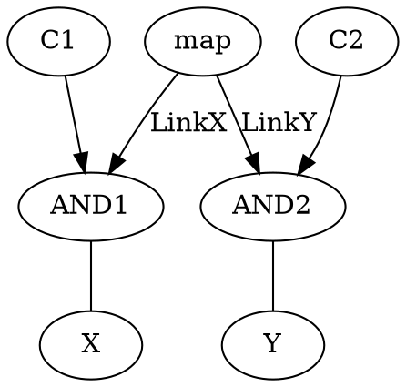

<p align="center">
図12 同時観測から連想形成
</P>

　連想の不確定性は、mapからAND1、あるいはmapからAND2へのリンクの確率$P^{11}$と$P^{00}$とで示される。リンクの$N^{11},N^{00}$はそのリンクへのフィードバックの回数を示す。

X、Yのそれぞれの過去の観測確率を$P_X,P_Y$とする。$X=1$のとき常に$Y=1$である場合は、LinkYのパラメータの具体的な初期値は以下の式で決定される。特に$P_Y$が十分に小さい場合は強度が増す。

$$ P_y^{11}=1$$

$$ P_y^{00}=0.5$$

$$ N_y^{11}= -log_2 P_Y $$

$$ N_y^{00}= 0$$

$X=0$のとき常に$Y=0$である場合は、以下の式でパラメータが決定される。

$$ P_y^{11}=0.5$$

$$ P_y^{00}=1$$

$$ N_y^{11}= 0$$

$$ N_y^{00}= -log_2 (1-P_Y) $$

LinkXも同様に定義される。それ以外のリンクは確定値を持つとみなす。確定値のリンクはフィードバックの対象とならない。

連想形成後は、$X=1$から$Y=1$への伝搬と、$X=0$から$Y=0$への伝搬との双方の伝搬確率をそれぞれ観測することでフィードバックを行う。この結果、連想リンクの$N_y^{11}$と$N_y^{00}$がさらに加算されていき、$P_y^{11}$側と$P_y^{00}$側の双方の確率が確定していく。

　連想を形成する対象X、Yは、観測結果のノードだけではなく、フィードバックの結果である条件ノードや因果関係を示すリンクノードなど、あらゆる部分集合の間で確率に基づいて連想を形成することが可能で、おそらくはあらゆる抽象概念に対応できる。

<a id="1_6"></a>

## 1.6 確率的自律論理生成アルゴリズム

SOLは、「確率的自律論理生成アルゴリズム」を利用する。このアルゴリズムは、ノードとリンクとを自律的に生成、修正する。

### 1.6.1 「条件」ネガティブフィードバックからのリンク分割とAND、OR論理演算ノード形成

フィードバックの結果、リンクの確率が1から0.5、あるいは0から0.5に近づいた場合は、リンクがネガティブフィードバックされたと考える。つまり、現在の前提ベクトルを条件として、リンクの不確定な確率部分を論理演算を用いて分離する。

リンクの伝搬確率を$P^{11}$,$P^{00}$の二項組で管理することで、ネガティブフィードバックが発生した伝搬確率の方向から、挿入すべきANDノード、ORノードを確定的に選択できる。$P^{11}$が1から0.5に近づいた場合はANDノード、$P^{00}$が1から0.5に近づいた場合はORノードである。XORノードは$P^{11}$,$P^{00}$双方が0.5に近づいた時に選択されるが、P11,P00双方に対して同一の条件でフィードバックされた場合に限定される。挿入された論理演算に追加される条件リンクは、前提ベクトルが等しいノードから選択される。

<p align="center">

</P>
<p align="center">
図13 AからBへのリンクに、条件Condを挿入
</P>

これが、SOLにおける論理演算の自律生成の基本であり、正確な論理演算の形成が可能になる。

### 1.6.2 「因果」フィードバックからの因果関係を示すリンクノードの入力を逆活性化

あるランダムリンクを通過した活性値の確率が別の確定確率の活性値と一致する場合は、ランダムなリンクがポジティブフィードバックされる。その結果、そのランダムリンクに相当する「リンクノード」がポジティブフィードバックによって活性化されると見なす。

リンクノードの具体的な実体は、ランダムリンクに仮想的に追加挿入された論理演算ノードに入力される、未知の入力ノードである。例を挙げると以下のようになる。$\land$は論理演算のANDである。

$$B=A \land L$$

リンクノードへの逆伝搬は、リンク両端の伝搬確率$P_{A}$,$P_{B}$の一致結果を伝搬する。具体的には伝搬確率$P_{L}$は以下の式となる。

$$ P_{L}=\frac{P_{B}}{P_{A}}$$

リンク前後で、確率1と0との双方の値が一致する場合は、特別に以下のリンクノードが生成される。この場合はXOR$\oplus$を用いる。

$$B=A \oplus \neg L$$

XORの場合のリンクノードへの逆伝搬は以下の式となる。

$$ P_{L}=\frac{P_{A}+P_{B}-1}{2P_{A}-1}$$

これは、異なる２つの集合間の因果関係の結果そのものを、論理演算に使用するための基本的な方法になる。$P_{A},P_{B}$の確率が中間値であっても、0.5以外で一致すれば確定確率1になる。

こうして、入力Aと出力Bとが前提集合として一致するとき、逆伝搬によってリンクノードMatchが活性化される。このリンクノードをAとBとの一致とみなす。

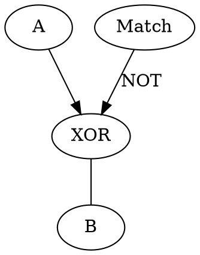

<p align="center">
図14 逆伝搬による因果関係の表現
</P>

これを因果関係のノード化と考える。因果関係のノード化はたとえば数値等の一致判定からの条件判断制御に応用できる。XORからの逆伝搬は完全一致を示し、ANDかORからの逆伝搬であれば包含関係を示す。

### 1.6.3 「代入」　写像を通過した結果との集合的に等価なノード間の結合

順方向の論理演算によって伝搬を行う際に、ANDやORなどの条件が追加されることでで伝搬集合的には小さくなっていく。ここで、別の論理演算を逆に伝搬することで、ANDやORなどの条件が除去されて条件適用前の伝搬集合を復元して伝搬できる。この結果、２つの離れた写像ノードの間で包含関係が成立することがある。この整合性のとれた写像ノード間の伝搬を代入と呼ぶ。以下の例では値Aは変数Xに含まれるので（$A \subset X$）、値Aを含むMap1は変数Xを含むMap2の部分集合となり、Map1がMap2に代入される。

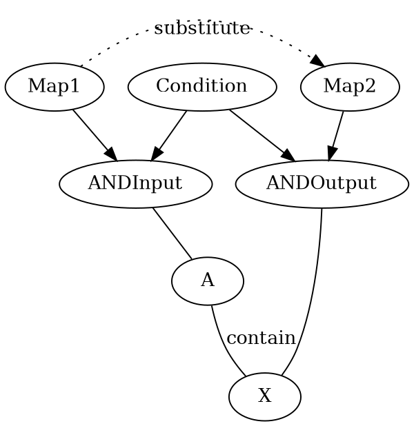

<p align="center">
図15 写像間の代入
</P>

ステート内の複数の条件を用いて論理演算を行うことも、階層的なステートを使用することも可能である。Prolog等のパターンマッチングと類似しており、より一般化された手法である。

### 1.6.4 「インスタンス化」ネットワークの確定部分複製

ネットワークを活性値が通過した結果、別の確定した活性値と衝突してポジティブフィードバックが発生し、ネットワークの一部が確定することがある。その結果、確定した部分だけを抽出することが可能になる。これがインスタンス化である。

この場合、リンクの経路に複数の出力リンクや論理演算入力リンクなどの分岐が存在する場合、経路のネットワークを部分的に複製して一種のインスタンスとする。インスタンスは不要なリンクの分岐が省略される。

下の図で例を示す。FunctionStateは右側のStateを部分集合として事前に代入している。代入されたStateから関数を通過して、値aを示す活性値に関数実行結果として伝搬が行われる。この伝搬集合はStateとの重複はないがStateの伝搬集合を矛盾なく拡大することが可能になる。こうして、関数の結果を複製して入力stateへと追加する。

<p align="center">

</P>

<p align="center">
図16 ネットワークのインスタンス部分複製
</P>

この「インスタンス化」は、関数の結果の代入にも用いられる。インスタンス化はネットワークの構造の中からさらに確率が確定した部分を抽出することができると同時に、伝搬の分岐を減らすことで伝搬の探索分岐を減らす作用がある。

### 1.6.5 「一般化」ネットワークの一般化部分複製

既存のネットワークが再利用された結果、部分的に不一致な部分がフィードバックされることがある。例えば、リンクのP00側へのフィードバックの場合は、逆にネットワークを部分的に拡大して複製することが可能である。これが「一般化」である。インスタンス化との最大の違いは、拡大部分が不確定で今後の検証で確認される必要があることである。

<p align="center">

</P>

<p align="center">
図17 ネットワークの一般化複製
</P>

### 1.6.6 「制御」リンク選択ノードによるリンク伝搬選択制御

あるノードに対して、結合される出力リンクは大量に存在しうる。リンクの探索を効率化するため、条件に対して、大量のリンクからのリンク選択を行う必要がある。この選択作用をSOL自身で決定、効率化することが望ましい。

リンク選択を制御するということは、選択したリンクに対応するリンク選択ノードを生成して、連想、活性値伝搬対象にする。その結果、選択先の活性値から得られた効用等と、リンク選択ノードとの連想を行うことができる。逆に、効用からリンク選択ノードが活性化され、効用に対応したリンクが選択されることになる。

リンク選択ノードの選択制御は、リンクに条件論理演算を追加して制御する方法とは異なり、リンクの伝搬確率を維持することができる。選択されていない状態でもリンクの伝搬自体はとくに阻害されないので伝搬自体は可能ではあるが、伝搬対象として選択される可能性は低い。

### 1.6.7 確率的自律論理生成

以上が確率的自律論理生成アルゴリズムの基本構成要素となる。AND、OR、XOR、NOT、写像リンク、リンク制御は、以上の手段を用いて自動生成できる。確率変動や集合に対して、伝搬確率が100%か0%に近い確定確率リンクを可能な限り選択する。観測数が多く、かつ不確定な伝搬確率のリンクは、別の条件を順次追加して可能な限り確定確率リンクに置き換えていく。

つまり、この確率的自律論理生成アルゴリズムは、アナログ値の重みを用いるニューラルネットワーク等と異なり、観測対象を可能な限りデジタル化して再現を試みるアルゴリズムである。確定的なデジタル論理が生成されるので、論理式の形で学習結果の出力が可能になる。

<a id="1_7"></a>

## 1.7 順序回路の自律生成

### 1.7.1 変動連想からステートへ

一般化された観測とは、ある時間ノードと、その時間に観測された複数の観測ノードとを連想で連結する作用である。例えば、複数のビットの値と時間ノードとが結合されて、ステートとなる。

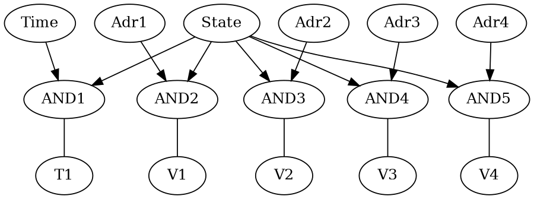

<p align="center">
図18 同時に観測されたステートの間の連想形成
</P>

### 1.7.2 ステートの分割と論理演算の自律生成

　V1,V2,V3,V4はある時間での観測結果でありbool値である。時間によってそれぞれの観測結果は異なる。

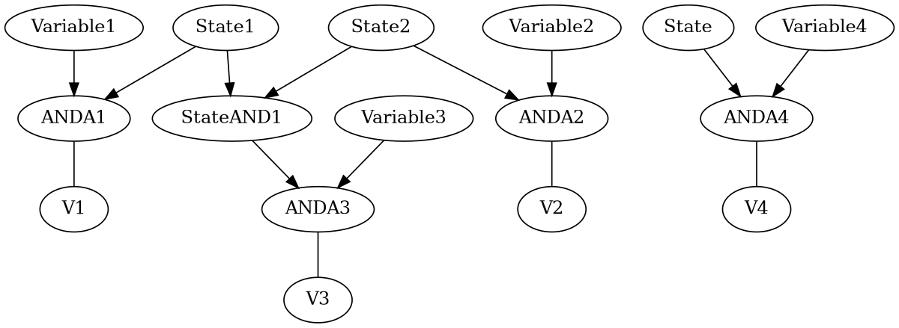

<p align="center">
図19 時間に対するステート変動への連想
</P>

  ステートで連結されたV1からV4のネットワークに対して、V1からV4の二度目の観測から再度伝搬が行われる。
　StateとV1との確率の衝突からフィードバックが発生してStateAND1が生成され、StateがState1とState2とに分割されてStateAND1の入力条件となる。この結果、以下の論理式が形成される。

  $$ V_3=V_1 \land V_2$$

### 1.7.3 時系列で連想形成

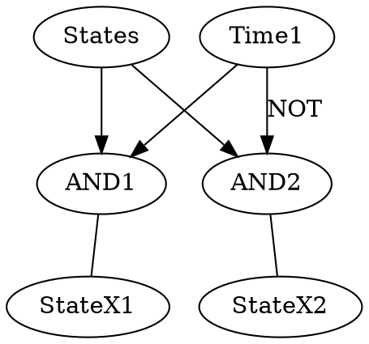

<p align="center">
図20 時系列に対するステート間の連想
</P>

Time1ノードの前後で、変動連想によってStateX1とStateX2とが排他的かつ連続の時系列で結合される。この結果、隣接時間のStateX1とStateX2との間の関連が導き出される。さらにStatesからAND2へのリンクが弱く条件が必要になることにより、State間の論理式が形成されて順序回路が形成されていく。

### 1.7.4 汎用関数生成

以上の要素を用いて自律的に順序回路を生成する。さらに学習されたステートを一般化して複製することで、写像前後の値を変数に一般化した汎用関数を生成する。

写像の対象となる値ノードは、これまでの例ではBool値であるが、さらなる抽象的な数値、座標、文字トークンなどのあらゆる対象の連結が可能である。抽象的なノード同士の演算などの相互作用はSOLの外部で定義される組み込み関数などで実現され、SOLは組み込み関数同士の連結を学習で選択することになる。

<div style="page-break-after: always;"> </div>
<a id="2"></a>

# 2 双方向論理演算

<a id="2_1"></a>

## 2.1 現実の時空間と写像に対する仮定

1. 時空間を分割する実集合が複数存在して、集合間の包含関係は未知である。

    実集合はそれぞれの時空間の物質等に該当し、時空間方向にある程度の広がりを持つ。複数の実集合は排他的な関係もありうるし、包含関係になることもあり、部分重複していることもある。これらすべての実集合の間で、写像によって関連を導き出す。

2. 複数の実集合の間で、特定の状況で同時に観測されるもの同士は「写像」として連結できる。

    ある実集合の部分が、別の実集合の部分と必ず「同時」に観測される場合がある。この場合の「同時」とは、実集合とは無関係な部分集合を選択するという意味である。この場合、実集合そのものの重複関係とは無関係に、双方の部分集合を含む包含集合を「写像」として形成できる。この包含集合を「写像集合」とみなす。この「写像集合」が、一般的に因果関係と呼ばれるものを表現すると予想できる。写像元は写像集合に完全に含まれるが、写像先は写像集合に対して部分集合だけを含むことがある。これは「含意」の定義による。
    
3. 複数の写像の間で論理演算を行う。

   複数の写像先同士で集合的論理演算を行うことにより、論理演算の結果の集合が最終的な写像先の部分集合となる。これが写像で一般化された論理演算である。

　現実の時空間は、このような構造になっていると仮定する。その上で、現実の集合と写像の構造がいかなるものであっても、観測からSOLで再現することを目指す。

<a id="2_2"></a>

## 2.2 ノードとリンク

SOLは、ノードとリンクとで構成される双方向ネットワークである。以下の全ての種類のノードはリンクで結合される。

1. 観測値の実体である値(Value)ノード
2. リンク同士の論理演算を示す論理演算(Logic)ノード
3. リンクを等価結合する接続(Joint)ノード
4. リンク間の排他性を示す排他(Exclusive)ノード
5. リンクと結合して外部と入出力するための関数(Funcition)ノード

値ノードは空間に存在する抽象的な部分集合であるが、スカラ、ベクトル値、文字などの実際の値をノードと一対一に対応させることも可能である。

論理演算ノードは、入力リンクに対するBool代数演算を行う。AND、OR、XORなどの種類がある。AND、OR、XORなどの論理演算は、複数の入力に対して論理演算と、集合演算の双方を適用する。出力リンクは論理演算の結果を伝搬するだけではなく、出力リンク同士の値と集合とが等価であることを示す。

接続ノードは、出力のみを持つノードであり、複数のリンクの値と集合とが等価であることを示す。複数のリンクが等価であるということは、複数のリンクからの到達でフィードバックを発生させるということでもある。

Exclusiveノードは、入力リンク間の排他性を示すノードである。入力ノードすべての間のNOTリンクとほぼ等価であるが効率のために使用する。

Functionノードは、値ノードで示された実際の値を用いて、実際の演算や外部入出力を行う。結果に相当する数値などの値ノードをその都度生成する。

リンクは、リンクを通過する際に適用する二項組の確率 $P^{f11}$,$P^{f00}$ と経験数 $N^{f11}$,$N^{f00}$ とで構成される。リンクを図で表記する時は、リンク先が論理演算の入力を示すときだけ矢印を持つ。それ以外は等価なリンクとみなして矢印を使用しない。


<p align="center">

</P>
<p align="center">
図21 リンクの種類
</P>

リンクの属性は以下の通りとなる。

|  内容         |   記号  |
|:----------------|:-------------------------|
| リンクの順方向伝搬確率		| $P^{f11}$,$P^{f00}$ |
| リンクの順方向経験数		| $N^{f11}$,$N^{f00}$ |
| リンクの逆方向伝搬確率		| $P^{r11}$,$P^{r00}$ |
| リンクの逆方向経験数		| $N^{r11}$,$N^{r00}$ |

Activation（活性値）は、複数のリンクと論理演算を通過して、起点からの伝搬確率を計算する。

<a id="2_3"></a>

## 2.3 リンク伝搬と論理演算

### 伝搬

リンク伝搬は、伝搬確率 $P^{11},P^{00}$ を使用して演算する。

$$  P' = P^{11} P+(1-P^{00})( 1-P )$$

### NOT伝搬

リンクの伝搬確率を以下のように設定すると、リンク自体が論理値のNOTの挙動を示す。

$$P^{11}=0$$

$$P^{00}=0$$

### AND演算

リンク伝搬の結果をAND論理演算で合成する。$P_1$,$P_2$...を入力して、$P'$を出力する。

$$  P'=  {P}_{1} {P}_{2} {P}_{3} ...{P}_{n} $$

### OR演算

リンク伝搬の結果をOR論理演算で合成する。$P_1$,$P_2$...を入力して、$P'$を出力する。

$$  P' =  1 - (1-{P}_{1})(1-{P}_{2})(1-{P}_{3})... (1-{P}_{n}) $$

### XOR演算

リンク伝搬の結果をXOR論理演算で合成する。$P_1$,$P_2$...を入力して、$P'$を出力する。

$$  P' = P_1(1-P_2) + (1-P_1) P_2$$

３変数以上のXORは再帰的に演算を適用する。

### Exclusive演算

リンク伝搬の結果をExclusive演算に入力する。この場合は演算を適用せずに伝搬を行う。

$$  P'=P_n $$

### 逆方向伝搬

リンクにはそれぞれ逆方向伝搬確率$P_{r}^{11},P_{r}^{00}$が定義される。

通常のリンクの場合は、順方向伝搬確率から即座に求められる。順方向の伝搬確率を $P^{f11}$ 、 $P^{f00}$ 、逆方向の伝搬確率を $P^{r11}$ 、$P^{r00}$ とする。この場合、逆方向の伝搬確率$P^{r11}$ 、$P^{r00}$は以下の式を用いて算出される。

$$ P^{f11}P^{r11}+(1-P^{f11})(1-P^{r11})=1$$

$$ P^{r11}=\frac{P^{f00}}{P^{f11}+P^{f00}-1} $$

$$ P^{r00}=\frac{P^{f11}}{P^{f11}+P^{f00}-1} $$

OR,ANDなどの論理演算からの逆伝搬の場合は、ベイズの定理に従って算出される。通常のリンクの情報に加え、リンクの伝搬元確率を $P$ 、伝搬先確率を $P^{'}$ とする。伝搬元確率と伝搬先確率の双方が得られなければ、逆方向伝搬確率は算出できない。

$$ P^{r11}=\frac{P P^{f11}}{P'}$$

$$ P^{r00}=\frac{(1-P) P^{f00}}{1-P'}$$

### エントロピーとリンクの確定化

確率に対するエントロピーは、二値のエントロピーの公式から算出できる。

$$ S =\sum_n P_nlogP_n $$

　これを二値化すると

$$ S = P log P + (1-P) log (1-P) $$

この結果、確率Pが1か0に近いものはエントロピーSが最小で、確率Pが0.5に近いものはエントロピーSが最大になる。SOLの目的は、リンクの確率を可能な限り1か0に近づけることである。つまり、エントロピーを最小化することが、SOLの自己組織化の目的の１つである。そのために、エントロピーの高いリンクは、適切な論理演算の挿入で分割してそれぞれのエントロピーを低下させる。

### リンクへのフィードバック

リンクへのフィードバックによって、リンクを通過する集合ごとに複数のリンクに縦方向に分離する。全体確率が1か0に近づくポジティブフィードバックは、分離の必要がない。全体確率が0.5に近づくネガティブフィードバックは、リンクを通過する集合の中に伝搬確率1と0の部分集合が混在していると考える。

例えば、これまでは確率1で通過していたが、今回は確率0で通過した場合は、通過した確率0の伝搬集合は、リンクを縦方向に分離する部分集合と考える。この縦に分割する手段が論理演算の挿入である。

<a id="2_4"></a>

## 2.4 リンクの縦分割と論理演算挿入

ノードからノードへと伝搬するリンクは、起点ノードと終点ノードをそれぞれ部分集合に分割して、リンクを縦分割することができる。

リンクを分割するのは、リンクを通過する集合の中で、伝搬確率が異なる集合があると観測された場合である。伝搬された観測確率が0.5に近づく場合に、リンクを観測確率1の要素と観測確率0の要素とに分離する。分離されたリンクの要素は、要素の集合を示す起点ノードの情報を利用して、そのノードと論理演算を形成する。

- $P^{11}$側が不確定で、$P^{00}$側が1確定であればANDを挿入する
- $P^{00}$側が不確定で、$P^{11}$側が1確定であればORを挿入する
- $P^{11}$側が不確定で、$P^{00}$側が0確定であればNOT(AND)を挿入する
- $P^{00}$側が不確定で、$P^{11}$側が0確定であればNOT(OR)を挿入する
- $P^{11}$側と$P^{00}$側の双方が不確定であれば、XORの挿入の可能性がある

<div style="page-break-after: always;"> </div>
<a id="3"></a>

# 3 写像

<a id="3_1"></a>

## 3.1 写像の定義

　論理演算は、集合の関係として記述できる。だが、より汎用的な論理を記述するためには、フリップフロップやメモリというような、様々な時間の状態を切り替えて使用するための記憶素子が不可欠である。そうでなければ、時間や空間の変動に対して汎用的な論理演算を作りだすことができない。
　
　SOLは、論理演算に、写像概念を加えた。写像は、時間や空間の異なる状態を結びつけ、新たな起点として利用する。この写像の作用こそが記憶素子の一般化でもある。さらに、複数の状態の一致を状態として管理することを可能にする。これにより状態間の順序などの関係そのものを状態として利用することも可能にする。

　写像を論理演算だけで表現する方法を示す。以下の例では写像元の部分集合Xから、写像先集合の部分集合Yに写像する。Mapノードは接続ノードの一種となる。

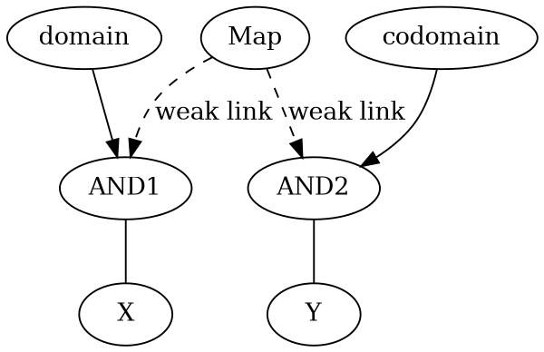

<p align="center">
図22 弱いリンクによる写像
</P>

　weak linkは$N^{11}$か$N^{00}$の観測数が少ないリンクであり、次の観測によるネガティブフィードバックによって不確定になることがある。このリンクを確定させるために更なる論理演算が追加されていくことになる。２つのweak linkのうちのどちらにも論理演算が追加できることになるが、整合性のある方の論理演算だけが確定することになる。

<a id="3_2"></a>

## 3.2 逆伝搬と代入

<p align="center">

</P>
<p align="center">
図23 写像間の代入
</P>

この図は複数の写像の間で写像元と写像先を共有する方法である。Map1ノードから見るとXは写像の値域であり、Map2ノードから見るとXは写像の定義域である。重要なのは、Map1ノードの値域の条件となるCondノードは、Map2ノードの定義域の条件となるCondノードとが同一である点である。

まず、map1ノードからmap2ノードへと活性値を伝搬する。map1ノードでの活性値の値は１である。map1ノードからXへの伝搬は通常の伝搬であるが、XからMap2ノードへの伝搬は逆伝搬となる。ただし、Map2ノードで拡大された確率は均一に値が１であるという保証はない。だが、活性値の代入の考え方を用いれば、Map2ノードに到達した伝搬集合の確率が均一に１になりうるという理由を示す。

Map1ノード上に存在する確率１の活性値は、Map1ノードからXに向けて伝搬を行う。その際にノードCondでANDをとり、伝搬集合が分断される。だが、さらにXからMap2ノードへと伝搬される際に、ANDの逆伝搬を通過する。その際に、Map1ノード側と同じCondノードで補完される。集合としてはMap1ノードの活性値と同じ大きさになる。Map2ノードの活性値は０と１の値のどちらかを完全に特定することはできない。だが、値１からのANDの逆伝搬であるので、Map2ノードの活性値は伝搬集合すべての値が１と仮定することは可能である。

この結果、Map1ノードにある活性値が、Map2ノードの活性値と伝搬集合的に同一であると仮定できる。これがSOLにおける代入であると考える。そのための条件は以下の通りである。

1. 伝搬元の値と、伝搬先の確定部分の値が等しいので矛盾がない。
2. ２つの伝搬集合の仮定ベクトルが同一である。

この代入は、オッカムの剃刀と類似した厳密にいえば根拠のないものである。だが、この代入の正当性については、代入値を用いた伝搬と観測との間で検証されていく。さらにフィードバックによって成立条件の追加が行われることになる。

<a id="3_3"></a>

## 3.3 写像と序列

一例として、Input入力からのテキスト解析を挙げる。以下の例では、互いに排他的な単語が３つが、互いに排他的なノードL1,L2,L3を用いて活性化される。一致判定は、単語から逆伝搬してInputANDが逆に活性化される。L1,L2,L3は互いに排他的なことが確認されればよい。そしてAND1からMap1への逆伝搬は集合的に拡大されて排他的でなくなる。Map1,2,3からのANDが結合されてInputANDが活性化される。逆に言えばすべての要素がなければInputANDは活性化されない。
このように、双方向伝搬を用いれば、集合的に重複のない単語間での集合論理演算が可能になる。

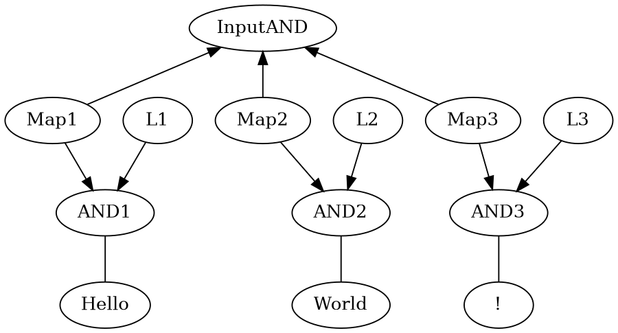

<p align="center">
図24 写像を用いた自然言語表現
</P>

さらに、この排他的なノードL1,L2,L3に時系列や距離の概念を加えて、実際のテキスト文章を表現する。

<a id="3_4"></a>

## 3.4 序列と自然言語

###  写像ノードと順序リンクによる表現方法

集合と写像とを用いて順序の表現するための手法を示す。PreviousStateとCurrentStateは連続した時間のステートであり、これらは上位の写像StateMapで連結される。PreviousStateとCurrentStateはそれぞれ順序を示すPrevious1,Next1の条件で連結される。

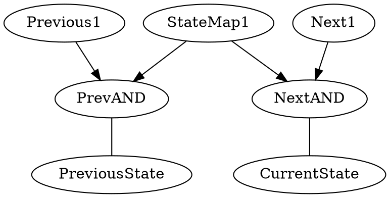
<p align="center">
図25 写像を用いた序列の表現
</P>

Previous1、Next1はこのStateMap1のために使用される条件ノードではある。だがこれは一般化された順序Previous,Nextノードの部分集合でもあるとみなす。このグループ化は別のネットワークの序列への代入に用いることができる。

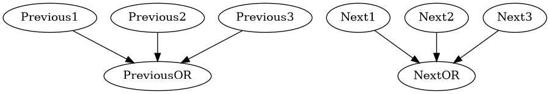
<p align="center">
図26 序列のグループ化
</P>


### 文章の一致判定

以下の例では、互いに排他的な単語が３つが、相互に順序を持つリンクNext1,Next2を用いて活性化される。Next1,Next2は単語間の順序が成立したときに活性化されるリンクノードでもある。一致判定は、Next1,Next2のそれぞれのリンクノードからInputANDへと入力される。前の例と異なり、単語の順序が入れ替わるとNext,Next2のリンクノードが活性化されない。その場合は、文章全体を示すmapに対する代入が行われない。

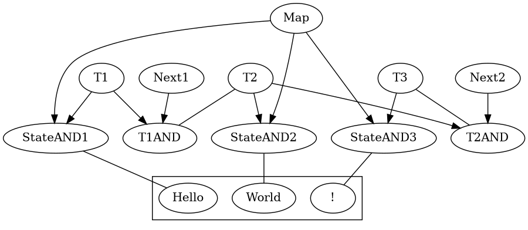

<p align="center">
図27 文章を写像の序列で表現
</P>

この序列付きの文章ネットワークは再利用される。次に部分的に同一の文章が入力された時には、この既存のネットワークに伝搬される。その結果、長い文章のStateは分割されて中途に条件を追加する。こうして文章のStateが階層化されて論理演算が付加され、他の文章や別の概念との関連付けが行われていく。

このような序列の表現方法は効率が悪いように見えるかもしれないが、時空間内の序列の構造に左右されない厳密な方法である。現在の多くの機械学習では序列を単なるベクトルで実装しているが、一次元のベクトルでは汎用性に限界がある。

<div style="page-break-after: always;"> </div>

<a id="4"></a>

# 4 活性値の双方向伝搬

SOLは、ニューラルネットワークと類似する活性値の伝搬を行うが、起点からの伝搬確率を厳密に管理する。それに加えて、仮定ベクトルによって伝搬された集合の情報を管理する。これに加え、SOLでは論理演算の双方向への伝搬を可能にして、写像を表現する。これによって、空間上のあらゆる集合の間で、ネットワークで接続されている限りは伝搬確率と伝搬集合を求めることが可能になる。

SOLのネットワークのリンクに対して、活性値を示す以下のActivationのオブジェクトをリンクごとに分配して伝搬し、階層的にActivationを生成する。Activationの持つ情報は基本的には以下の通りである。

1. 伝搬確率(Propagated probability)

　伝搬された確率値であり、値は0から1までのスカラ値である。

2. 仮定ベクトル(Assumption vector)

　このActivationの起点となる複数の伝搬集合を示す仮定ベクトルである。

<a id="4_1"></a>

## 4.1 活性値の伝搬の流れ

1. 仮定からの確率伝搬

    活性値は仮定を起点とする。仮定は起点となるノードの確率を１か０に仮定する。この起点確率に対してリンク伝搬や論理演算を適用して活性値を伝搬させていく。
    
2. 仮定ベクトル同士の論理演算と複数の仮定ベクトルの統合

    異なる仮定ベクトルを持つ複数の入力を用いて論理演算を行う際に、仮定ベクトルが示す集合の重複部分だけを抽出して伝搬する。仮定ベクトルが重複しない部分は論理演算は適用されない。
    
3. 論理演算の逆伝搬と仮定ベクトルの相補的合成

- 論理演算の出力側の集合を、論理演算の入力側に逆に伝搬する。
- 値１をANDから逆伝搬させるときはそのまま全ての入力に対して確率１と仮定ベクトルを伝搬する。
- 値０をANDから逆伝搬させるときは、１つの入力を除いてすべての１の入力がある場合は、入力が０として確定する。
- 値０をANDから逆伝搬させるとき、さらに入力の中にすでに０がある場合は、逆伝搬する入力は確率が不確定となる。だがここで、不確定な確率を確定させる手段が別に存在する。これが逆伝搬を写像に用いることができる理由である。

4. 活性値衝突と、仮定ベクトルの要素比較

    複数の活性値が別の経路を通過して同一のノードに到達した場合、双方の仮定ベクトルの間に共通部分があれば双方の確率を比較する。確率が異なっていれば確率を等しくするようにフィードバックを行う。

5. 組み込み関数と観測

   活性値が組み込み関数に到達することで、外部からの観測や外部動作などを行う。観測とは入力の仮定ベクトルと出力ノードとを写像で結合することである。

<a id="4_2"></a>

## 4.2 仮定ベクトル

### 仮定ベクトル要素

　仮定ベクトルの要素はそれぞれ、特定のノードからノードへのリンクの伝搬確率$P^{11}$か$P^{00}$のどちらかが1か0であるという仮定を意味する。ノードの値が1か0かを仮定することによって、その先の伝搬集合が２つに分断される。

1. 起点リンク

　仮定ベクトルの要素は、起点となるリンクの伝搬確率を０か１のどちらかに仮定する。

2. 逆伝搬選択

　ORノードへの値1の活性値から入力リンクを逆伝搬して、その入力ノードを1つ選択する。この選択作用はORノードから入力ノードへのリンクの仮定と見なすことができる。ANDノードへの値0の活性値からの逆伝搬も同様である。

3. ネットワーク中途の共通起点

　複数の伝搬が衝突した際に、経路のすべての仮定ベクトルを考慮するのは無駄が多い。そのため、複数の伝搬の共通の起点に対して仮定を設定して、それ以前の共通のパスは仮定の比較を行わない。
　
### 論理演算の相互作用

伝搬集合同士でAND、ORなどの論理演算を行うと仮定ベクトルが合成される。この際の合成は以下のルールに従う。

- 仮定ベクトル間で異なる仮定ベクトル要素はそのまま合成先に追加される。
- 仮定ベクトル間で同一の仮定ベクトル要素は１つに集約される。
- 集合的に包含関係の仮定ベクトル要素との合成は伝搬集合的に小さい要素に取って代わる。
- 集合的に排他的な（起点確率が異なる）仮定ベクトル要素との合成は伝搬集合自体が空集合になる。

### 活性値の衝突と仮定ベクトル

　複数の活性値が同一の接続ノードや論理演算ノードに到達した場合は、それらの活性値は等価なものとして衝突対象となる。論理演算に関して言えば、入力の合成結果と出力とが衝突対象となる。
　仮定ベクトルが示す伝搬集合に重複があれば、伝搬された結果の確率値が一致していなくてはならない。一致していない場合はフィードバックが実行される。

<a id="4_3"></a>

## 4.3 活性値の確率伝播

活性値(Activation)をリンクに沿って伝搬して、リンクの伝搬確率やノードの確率合成に従って確率を伝搬させ、リンクの先の組み込み関数を実行するのがSOLの基本となる。

$P^{f11}$ はPの確率１からP'の確率１への伝搬確率であり、 $P^{f00}$ は、Pの確率０からP'の確率０への伝搬確率になる。確率論の自明な適用である。

$$	P'=P P^{f11} +(1-P)(1-P^{f00})$$

AND演算では複数のActivationの確率を統合して、出力リンクに伝搬する。確率計算は、入力された伝搬確率 $P_{1}$ , $P_{2}$ , $P_{3}...$ を複数利用して、以下のように計算する。

$$	P'=P_{1} P_{2} P_{3}... $$

OR演算の確率計算は以下のようになる。

$$	P'=1-\{ (1-P_{1}) (1-P_{2}) (1-P_{3}) ... \} $$

XOR演算の確率計算は以下のようになる。3入力以上の場合は以下の式を再帰的に適用する。

$$	P'= P_{1} (1-P_{2})+ (1-P_{1})P_{2} \} $$

出力リンクの数が膨大となる場合は、いくつかのリンクに限定してActivationを伝搬することになる。リンクの限定の方法は別に提供する。

<a id="4_4"></a>

## 4.4 確率の逆伝搬

Activationは、リンクの方向と逆にたどる逆伝搬(backward activation)も可能である。ニューラルネットワークの技法のback propagationとは意味が異なる。

逆伝搬は、リンクごとの逆伝搬確率 $P^{r11}$,$P^{r00}$ を利用して、順方向伝搬の確率計算と同じ方法で行う。ノードの論理演算は適用されない。

$$	P'=P P^{r11} +(1-P)(1-P^{r00}) $$

結果、全体の伝搬確率は、以下のような複数のリンクに対する多項式として一般化される。

$$  P=f(P_1^{f11},P_1^{f00},P_2^{r11},P_2^{r00},P_3^{f11},... )$$

<a id="4_5"></a>

## 4.5 活性値の衝突

活性値の衝突とは、同一ノードを起点として同一ノードへと到達した複数の伝搬経路で、伝搬された仮定ベクトルが重複しているにもかかわらず伝搬確率が異なることを言う。

原則として、$P=0.5$、つまり確率不確定な伝搬集合との部分重複は、伝搬集合としては無関係とみなせるので衝突ではない。逆に、確率が双方ともに確定であれば、伝搬集合に重複があれば確率の衝突と見なすことができる。確率0.5を確率1（あるいは0）側が伝搬集合的に完全に包含する場合は、確率1側の確定性に矛盾が発生するので、衝突とみなされる。

以上の手段で伝搬集合の大きさの比較が行われ、伝搬集合が完全に重複している部分に対して確率の衝突、フィードバックが適用される。

<div style="page-break-after: always;"> </div>

<a id="5"></a>

# 5 確率変動分配階層フィードバック

このフィードバックの手法は、ベイジアンネットワークの無制限の階層に対して、どのリンクが観測確率の誤差の原因になっているかを的確に発見できる、新たに開発した手法である。

従来のニューラルネットワークでは、バックプロパゲーションを用いて深いリンク層に対して影響を及ぼすことができるが、より深いリンク階層に対する誤差原因の特定はやはり難しくなる。ディープラーニングと呼ばれるものも、相対的に階層が深いと言っているに過ぎない。

このフィードバックの前提は以下の通りである。

1. SOLのリンクには伝搬確率があり、論理演算もまた確率計算となる。複数のリンクと論理演算とを通過した結果の全体伝搬確率が求められる。観測された新たな伝搬確率 $P'$ に対して、ネットワーク伝搬確率を近づけるようにリンクごとの$\Delta P_n$に対してフィードバックされる。

$$P'=P_1 P_2 ... （P_n+\Delta P_n） ... P_{x-1}P_{x}=P_n+E_n\Delta P_n ...$$

2. それぞれの確率Pのリンクが確率P'になる変動発生確率は、過去の観測確率 $P$ と観測数 $N$ とに依存し、純粋な確率論で算出できる。

3. リンク全体の変動発生確率は、すべてのリンクの変動発生確率の積となる。この全体変動発生確率を最大にする。

4. 個々のリンクにはフィードバックごとに観測数Nが加算される。フィードバックされた伝搬確率を用いて、観測数に応じて既存の伝搬確率を補正する。観測数が多いリンクはフィードバックによる補正もわずかとなる。

以上の条件を満足するように、計算方法が決定された。この計算方法を確率変動分配階層フィードバックと呼んでいる。

<a id="5_1"></a>

## 5.1 リンク上の二項組確率伝播

伝搬する活性値は、１つの伝搬確率 $P$ を持つ。この確率 $P$ は、現在の仮定ベクトルの集合の持つ確率となる。補集合に存在する確率は $(1-P)$ になる。

活性値が確率的に確定したリンクを通過するときは、以下の伝搬確率に従って確率が伝達される。

$$	P^{11}=1 $$

$$	P^{00}=1 $$

NOTリンクは、仮定ベクトルの確率に対して作用する。通過する仮定ベクトルの集合を反転させるものではないことに注意する。

$$	P^{11}=0 $$

$$	P^{00}=0 $$

リンクは、$P^{11}$, $P^{00}$ とは別に、リンクの強度を示す $N^{11}$ , $N^{00}$ というパラメータを持つ。この強度は、フィードバックごとに加算され、リンクの確率を確定させる。

<a id="5_2"></a>

## 5.2 双方向伝搬と論理演算の確率計算

SOLでの活性値伝搬における、確率計算の手法を示す。通常のリンクの伝播確率の計算方法は以下のようになる。

$$	P' = P P^{11} + (1-P)(1-P^{00}) $$

AND演算を行う場合は以下のようになる。P=1となる伝搬確率である。

$$	P_{1}'= P_{1}^{1} P_{1}^{2} P_{1}^{3} ...$$

OR演算

$$	P_{1}'= 1-P_{0}^{1} P_{0}^{2} P_{0}^{3} ...$$

リンクの逆伝搬確率は、リンクの順方向確率からベイズの定理を適用して算出する。 $P_{1}$,$P_{0}$ はノードAの確率。 $P^{f11}$,$P^{f00}$ はノードAからBへの順方向伝搬確率。 $P^{r11}$,$P_{r00}$ が求めるノードBからノードAの逆方向伝搬確率とする。

$$	\{ P^{f11}+(1-P)(1-P^{f00}) \} P^{r11}=P_{1}P^{f11}$$

$$	P^{r11}=\frac {P^{f11}}{ P^{f11}+P_{0}(1-P^{f00}) }$$

$$	\{ P^{f11}(1-P^{f11})+(1-P)P^{f00} \} P^{r00}=(1-P)P^{f00}$$

$$	P^{r00}=\frac {1-P^{f00}}{P^{f11}(1-Pf^{11})+(1-P)P^{f00}}$$

AND演算、OR演算などの論理演算から入力への逆方向伝搬もまたベイズの定理を用いて算出する。ただし、リンク入力の観測確率P(A)と論理演算出力の観測確率P(B)を用いる必要がある。

$$ P^{r11}=\frac{P(A) P^{f11}}{P(B)}$$

$$ P^{r00}=\frac{(1-P(A)) P^{f00}}{1-P(B)}$$

以上のように、SOLのノードごとの伝搬確率合成は、確率論に忠実で自明なものである。シグモイド関数などの非線形要素は利用しない。

<a id="5_3"></a>

## 5.3 フィードバックの適用対象

現在利用しているネットワーク全体の伝播確率で算出された $P_{total}$ を、同じ状況で確率が異なる衝突相手の伝搬確率 $P_{total}'$ に合わせるのがフィードバックとなる。
SOLのフィードバックは、衝突した２つのパスが通過するリンクの、 $P^{11}$ , $P^{00}$ それぞれに対して適用される。その強度は、リンクの確率、リンクの経験数に応じて変わってくる。

フィードバックされる結果となる $P^{11'}$ , $P^{10'}$ を、補正値 $\Delta P^{11}_n$ , $\Delta P^{00}_n$ を使って補正する。
２つのパスの全体確率を、それぞれ補正値を追加した多項式として伝搬させて計算する。大規模な方程式になる。

$$	P^{11'}_n=P^{11}_n+\Delta P^{11}_n $$

$$	P^{00'}_n=P^{00}_n+\Delta P^{00}_n $$

$$	P_{total}=(P^{11'}_1)(P^{11'}_2)(1-P^{11'}_3)... $$

　２つのパスA,Bそれぞれの全体確率は、大量の $\Delta P^{11}_n$ や $\Delta P^{00}_n$ に対する伝搬多項式になる。さらに、この２つのパスの式が等しくなることより、

$$	P_{totalA}-P_{totalB}=\Delta P_{total}=0 $$

　この式を満たし、かつ変動確率が最小となる$\Delta P_{n}$をN個求めればよい。だが、まともな方法では、 $\Delta P_{n}$ をそれぞれ変動させて解を求めるという、組み合わせ爆発問題となる。

　そのため、それぞれの確率観測確率の変動量 $\Delta P_{n}$ を近似的に求める手段を提供する。

<a id="5_4"></a>

## 5.4 効果係数$E_n$の算出

以下は、リンクの伝搬確率の変動$\Delta P_n$が最終的な確率$P_n$に対してどの程度を作用するかを示す式である。確率変動$\Delta P_n$に作用する確率は$E_n$であり、$R_n$は定数項である。

$$ P_n  = R_n+ E_n\Delta P_n $$

この確率$P_n$は、さらなるリンクや論理演算が適用されて変化する。そのために、$E_n$,$R_n$を入力して、$E'_n$,$R'_n$を出力する式を示す。リンク伝搬確率はそれぞれ$P^{11}$,$P^{00}$とする。

あるリンクの$P^{11}$側を起点とする場合は以下の式となる。リンクまでの伝搬確率を$P_{n-1}$とする。

$$ R_n+E_n\Delta P^{11}=(1-P^{00})(1-P_{n-1})+P_{n-1} \Delta P^{11}$$

$$ R_n = (1-P^{00})(1-P_{n-1})$$

$$ E_n=P_{n-1} $$

リンクの$P^{00}$側を起点とする場合は以下の式になる。

$$ R_n+E_n\Delta P^{00}=P^{11}P_{n-1}+1-P_{n-1}+(P_{n-1}-1)\Delta P^{00}$$

$$ R_n = P^{11}P_{n-1}+1-P_{n-1}$$

$$ E_n=P_{n-1}-1$$

起点ではないリンクによる伝搬は以下の式となる。

$$ R'_n+E'_n\Delta P_n=1-P^{00}+(P^{11}+P^{00}-1)Rn + (P^{11}+P^{00}-1)( E_n\Delta P_n)$$

$$ R'_n=1-P^{00}+(P^{11}+P^{00}-1)Rn $$

$$ E'_n= (P^{11}+P^{00}-1)E_n$$

次に、論理演算に対する伝搬確率を求める。ここからは、$P^{11}$、および $P^{00}$はそれぞれm番目、n番目のリンクと見なし、$P_{m}$、$P_{n}$のように表記する。$\Delta P_n$以外の入力の合成確率を$P$とする。AND演算における$E'_n$は
 
$$ R'_n + E'_n\Delta P_n=PR_n+PE_n \Delta P_n$$

$$ R'_n = PR_n$$ 

$$  E'_n=PE_n$$

OR演算における$E'_n$は

$$ R'_n + E'_n\Delta P_n=P+R_n-PR_n+(1-P)E_n \Delta P_n$$

$$ R'_n = P+R_n-PR_n$$

$$ E'_n=(1-P)E_n$$

XOR演算における$E'_n$は

$$ R'_n + E'_n\Delta P_n=P + R_n-2PR_n+ (1-2P)E_n \Delta P_n $$

$$ R'_n = P + R_n-2PR_n$$

$$ E'_n = (1-2P)E_n$$

次に逆伝搬の方法について示す。論理演算からの逆伝搬であれば演算に関わらず $P^{r11}$、および $P^{r00}$ を用いる。以下の式になる。

$$ R'_n=1-P^{r00}+(P^{r11}+P^{r00}-1)Rn$$

$$ E'_n= (P^{r11}+P^{r00}-1)E_n$$

AND演算の逆伝搬で、他の入力の確率が$P_f$に確定している場合は以下の式になる。導出は複雑なので省略する。$\Delta P_n$ の二次以降の項は必要ではあるが省略することが多い。

$$ P'=P_fP_r = (R+E\Delta P_n)(R'+E'\Delta P_n)$$

$$ R'+E'\Delta P_n =\frac{P'}{R} - \frac{P'E}{R^2}\Delta P_n -\frac{P'E^2}{R^3}(\Delta P_n)^2  ...$$

$$ R' = \frac{P'}{R}$$

$$ E' = \frac{P'E}{R^2} $$ 

OR演算の逆伝搬は

$$ R' = \frac{1-P'}{1-R}$$

$$ E' = \frac{(1-P')E}{(1-R)^2} $$

XOR演算の逆伝搬は

$$ R' = \frac{P'-R}{1-2R}$$

$$ E' = \frac{(2P'-1)E}{(1-2R)^2} $$

以上の式をネットワークの経路に対して連続適用することで、経路全体の伝搬確率が求められる。この伝搬確率が観測結果$P'_{total}$と等しいと考える。複数のリンクの変動はすべて和をとれば良い。確率は1以下なので確率の積は確実に収束する。$\Delta P_n$ の二次以降の項は必要ではあるが省略することが多い。

$$ P'_{total}  = R_{total}+ \sum _n E_{n total}\Delta P_n + \sum _m \sum _n　E_{m total}E_{n total}\Delta P_m P_n ... $$


この結果、伝搬によって求められた最終的な作用確率$E_{ntotal}$こそが、それぞれのリンク $\Delta P_{n}$ に対する作用の係数となる。

$$\sum_{n} E_{ntotal} \Delta P_{n} \approx P'_{total} - P_{total}$$

<a id="5_5"></a>

## 5.5 重み値$w_n$の式の導出

伝搬で通過したリンクにそれぞれフィードバックされる確率補正値 $\Delta P_n$ は、伝搬リンクの確率をすべて以下の形で書き換えて計算することで、それぞれ求められる。

$$ P_n'=P_n + \Delta P_n$$

リンクnの伝搬確率 $P_n$ に対して、観測結果としての伝搬確率 $P_n'$ が観測される変動発生確率 $t_n$ は、一種の二項分布に従い、以下の式で得られるとする。

$$ t_n=\lim_{m \to \infty }\{\dbinom{m}{mP_n'} P^{mP_n'} (1-P_n)^{m(1-P_n')} \}^{-m}$$

この式は具体的に言えば、確率$P_n$のコイントスをm回利用して、結果の合計が$mP~{'}_n$となる確率を求め、mに対する極限をとっている。以下のコンビネーションの式を利用している。

$$ \dbinom{m}{mP_n'} =\frac{m!}{mP_n'! m(1-P_n')!} $$

さらに、リンクの過去の観測回数$N_n$を乗数することで、結果が$mN_nP~{'}_n$となる確率を求める。これが、確率 $P_n$ が複数回観測されたリンクでの変動発生確率になる。

$$ T_n=\lim_{m \to \infty }\{\dbinom{mN_n}{mN_nP_n'} P^{mN_nP_n'} (1-P_n)^{mN_n(1-P_n')} \}^{-m}$$

まずは、コンビネーションの値の計算には、以下の「スターリングの近似式」を使う。

$$n! \sim {\sqrt {2\pi n}}\left({\frac {n}{e}}\right)^{n}\{1-\frac{1}{12n}+\frac{1}{288n^2}+...\}$$

最後の1以外の定数は近似として省略して、以下の式を用いる。

$$n! \sim {\sqrt {2\pi n}}\left({\frac {n}{e}}\right)^{n} $$

これを用いてコンビネーションの式に代入すると、

$$\dbinom{mN_n}{mN_nP_n'}=\frac{mN_n!}{(mN_nP_n')! \{mN_n(1-P_n')\}!} $$

$$ \sim \frac{\sqrt{2\pi mN_n}}{\sqrt{2\pi mN_n  2\pi mN_n P_n'(1-P_n')}} \left(\frac{N_n}{e}\right)^{mN_n}  \left(\frac{N_nP_n'}{e}\right)^{-mN_nP_n'} \left(\frac{N_n(1-P_n')}{e}\right)^{-mN_n(1-P_n')}$$

$$ = \frac{1}{\sqrt{2\pi mN_n P_n'(1-P_n')}}\frac{1}{P_n'^{mN_nP_n'} (1-P_n')^{mN_n(1-P_n')}}$$

このコンビネーションの値を使って、$T_n$に代入する

$$ T_n=\lim_{m \to \infty } \{P_n^{mN_nP_n'}(1-P_n)^{mN_n(1-P_n')} P_n'^{-mN_nP_n'} (1-P_n')^{-mN_n(1-P_n')} $$

$$\{2\pi mN_n P_n'(1-P_n')\}^{-1/2} \}^{-m}$$

$$= P_n^{N_nP_n'}(1-P_n)^{N_n(1-P_n')} P_n'^{-N_nP_n'} (1-P_n')^{-N_n(1-P_n')} \lim_{m \to \infty } \{2\pi mN_n P_n'(1-P_n') \}^{-m/2} $$

　この$T_n$こそがリンクで$P_n'$が観測される確率であり、この確率変動をすべてのリンクで平均化するように$P_n$の変動を求めれば良い。両辺logを取って、左辺を$\tau_n$で置き換える。最後の項はmの極限で収束するので省略する。

$$ \tau_n =  \log T_n =  N_nP_n' \log P_n + N_n(1-P_n')\log(1-P_n) $$

$$- N_nP_n'\log P_n' -N_(1-P_n')\log(1-P_n') $$

$$  =  N_n \{ P_n' \log P_n + (1-P_n')\log(1-P_n) - P_n'\log P_n' - (1-P_n')\log(1-P_n') \} $$

　この$\tau_n$の式に対して$P_n$で微分を行う。

$$  \frac{d\tau}{dP_n}=N_n \{ \frac{P_n'}{P_n}-\frac{1-P_n'}{1-P_n}\}$$

$$ = N_n \{ \frac{P_n'(1-P_n)-(1-P_n')P_n}{P_n(1-P_n)} \}$$

$$ = N_n  \frac{P_n'-P_n}{P_n(1-P_n)}  $$

$$ P_n'=P_n \pm \frac{P_n(1-P_n)}{N_n} \frac{d \tau_n}{d P_n} $$

　これにより、$\tau$をパラメータとした$P_n$の変動の重み$w_n$が計算できる。

$$P_n+\Delta P_n$$

$$  \Delta P_n = w_n \Delta \tau_n$$

$$
w_n = 
\begin{cases}
  \dfrac{P_n(1 - P_n)}{N_n} & \text{if } P_n > 0.5 \\
  -\dfrac{P_n(1 - P_n)}{N_n} & \text{if } P_n < 0.5
\end{cases}
$$

こうして、それぞれのリンクのウェイト$w_n$はリンクの既知の確率$P_n$と観測回数$N_n$とで決定される。ウェイトの符号は、リンクの確率のエントロピーを減少させる方向に統一する。なお、ウェイトの符号はフィードバックの対象次第ではさらに反転する。

<a id="5_6"></a>
## 5.6 確率補正値 $\Delta P_n$ の算出

ここからは複数のリンクへのフィードバック分配方法について述べる。観測された全体確率を、$P^{'}_{total}$ とする。この確率に合致するように、それぞれのリンクの変動 $\Delta P_n$ を求める。$E_n$ は、前述したとおりリンクnに対する伝搬確率で決定される効果係数である。

$$ P^{'}_{total}=P_{total}+ \Delta P_{total} = P_{total}+\sum_n E_n \Delta P_n + \sum _m \sum _n　E_{m total}E_{n total}\Delta P_m P_n ...$$

さらにもう一つの制約条件は、全体変動発生確率 $T$ を最大値にすることである。

$$ t_{all}=\prod_n t_n$$

この式は$\tau_n$を用いると以下のようになる。

$$T=\log t_{all} = \sum_n \log t_n = \sum_n \tau_n$$

この全体変動発生確率$T$（ラージタウ）を最大にして、かつリンクごとのエントロピーを最小にしつつ$\tau_n$の値を可能な限り均一に分配するように、リンクごとの$P_n$の変動値を定めるのがフィードバックの目的である。

$$ \Delta P_{total}=\sum_{n} E_n w_n \frac{d \tau_n}{d P_n} $$

<a id="5_7"></a>
## 5.7 フィードバック分配とネットワーク複製
### 均等分配フィードバック

フィードバックする変動量が少ない場合は、それぞれのリンクの伝搬確率のエントロピーの変動を最小するためにリンクの重みに応じて均等分配を行うことになる。まずは、それぞれのリンクnの変動発生確率$\tau_n$を共通パラメータ$\tau$で置き換える。

$$\Delta \tau =  \Delta \tau_n$$

それぞれの $\Delta P_n$に対して、変動全体 $\Delta P_{total}$ を$E_nw_n$の比率を用いて分配する。

$$\Delta P_{total} =  \sum_n E_n w_n\Delta \tau$$

$$\Delta \tau = \frac{\Delta P_{total}}{ \sum_n E_n w_n} $$

こうして求められた$\Delta \tau$を用いて、全体のフィードバック $\Delta P_{total}$ を、それぞれのリンクの $\Delta P_n$ に対して分配することができる。

$$ P_n' =P_n+\Delta P_n =P_n+w_n \Delta \tau$$

$P'_n$が1以上や0以下になることもありうるので、そういう場合は$P'_n$を1か0に飽和させて$P_{total}$をその都度再計算する。そののちに飽和したリンクを除去して再び$\Delta \tau$を計算する。

ここで、確率の符号が１から０へと完全に反転するときなど、均等分配ができない場合がある。理由は、それぞれのリンクの変動同士の積の項が無視できなくなるためである。実際の二値論理のフィードバックではこのケースの方が多い。そのための手順を示す。

### ウェイト反転フィードバック

あるリンクの効果係数$E_n$が1に近い場合は、そのリンクへのフィードバックだけで全体確率の反転が可能になる。この場合は、他のリンクの伝搬確率エントロピーを最小に保つために、伝搬確率のエントロピーと経験数Nが最小のリンクを１つ選択してウェイトを反転する。そして、全体確率を完全反転するようにフィードバックする。効果係数$E_n$が1に近いリンクは複数ありうるため、リンク選択は複数の可能性がある。それぞれの選択ごとにネットワークの複製を行い、フィードバックを適用する。優先度はリンクのウェイトによって決定される。

フィードバックする全体確率が１と０のどちらかである場合は、１つのリンクを選択して反転させるだけでフィードバックは終了する。だが、フィードバックする全体確率が１と０との間の中間値である場合は、１つのリンクの反転を適用したのちに、それ以外のリンクのエントロピーを最小化するための均等分配を改めて行う。フィードバックの目的は、全体のリンクエントロピーを最小化することと、確率的に最大で変動が最小限にすることであり、この目的に合致するならばウェイトの反転を行う。

<a id="5_8"></a>
## 5.8 フィードバック観測数$N$を用いたリンクの伝搬確率補正

このフィードバック補正された確率は、そのままではリンク自体が更新する確率にはならない。リンクのそれまでの観測数 $N_n$ が大きければ、それだけリンク確率補正量が小さくなる。$N_n$に加算する値は常に１ではなく、実際の伝搬に使用された効果係数$E_n$とフィードバックされる相手の観測数$N_f$によって決定される。

$$ N_n'=N_n+N_fE_n$$

結果、最終的に更新される確率$P''_n$は以下の通りになる。

$$　{P''_n}^{N_n'}={P_n}^{N_n} {P'_n}^{N_fE_n}$$

乗算平均と加算平均はそれほど差がないため以下の式で近似を行うこともできる。

$$　P''_n=\frac{N_nP_n +N_fE_nP'_n}{N_{n}'}$$

$P_n$はリンクの$P^{11},P^{00}$が混在しており、フィードバックはリンクの$P^{11},P^{00}$それぞれに対して適用される。

算出された確率 $P^{11}_ n$ へのフィードバック結果に基づき、 $P^{11}_n$ がエントロピー減少方向、つまり確率が1か0のいずれかに近づいたリンクは、ポジティブフィードバックされたとみなす。逆に、 $P^{11}_n$ のエントロピーが上昇する方向、つまり確率0.5に近づいたリンクをネガティブフィードバックされたとみなす。ネガティブフィードバックは、そのリンクになんらかの見えない条件があるために発生したと考え、その条件を検索する。$P^{00}_n$ についても同様にフィードバックを算出する。

リンクの利用数$N_n$が0の場合は、確率 $P_n=0.5$ とみなされる。ポジティブフィードバックだけでは、確率1か0に近づくことはできるが、確率1か0そのものにはなれない。

この条件リンク形成については、後述する自律生成写像論理回路アルゴリズムの一部として実装される。

<div style="page-break-after: always;"> </div>

<a id="6"></a>

# 6 連想

<a id="6_1"></a>

## 6.1 連想対象選択

連想とは、集合的に独立した２つのノード間を写像で連結して因果関係を予測する作用である。因果関係がありうる連想を形成するには、同時に変動した２つのノードを選択すれば成功率が高い。なお、同時の変動は、時間軸、座標などあらゆる変動を対象とする。それぞれのノードの変動発生の確率によって同時変動の確率、つまりは連想の強度を定量的に定めることができる。

そのための条件は以下の通りである。

1. 同時に観測された確率エントロピーがほぼ等しい（多くの場合は、確率１か０のどちらかの確定確率）。

2. 同一起点からの仮定ベクトルが同一か、あるいは包含関係がある。同時変動はそれ自体が仮定ベクトルが完全に一致しているか包含関係がある場合とみなされる。

ここで、関連がない事象同士が偶然同時活性化されて連想対象になることがありうるが、偶然による連想は更なる同時活性化の可能性が低いので、結果的にネガティブフィードバックされて不確定なリンクとなる。

<p align="center">

</P>
<p align="center">
図28 連想形成
</P>


連想の候補となるノードは、フィードバックが適用されたリンクの終点となる。フィードバックが適用されたことにより、そのリンクには何らかの条件が追加されていると見なすことができる。

このフィードバックの変動と同時に変動したノードが、連想の可能性があると見なされる。さらに、値の変化の確率が低い変動ノードは連想の確度が高いと見なされるため、最優先で選択される。

観測とは、現在の時空間を示すノードと観測値を示すノードとの連想を行う作用であり、基本的に外部の関数によってその都度生成される。

<a id="6_2"></a>

## 6.2 連想形成と条件の付加

<p align="center">

</P>
<p align="center">
図29 仮定ベクトル間の差分
</P>

連想はmapからのandを行うための条件である２つのノードを選択、あるいは生成する必要がある。これらの条件ノードは、仮定ベクトルの差分から生成される。上の図ではAV1とAV2との差分であるノードF,ノードCがそれぞれ条件となる。
   
<a id="6_3"></a>

## 6.3 伝搬確率、経験数の算出

連想リンクは確定なリンクではなく、観測された同時活性値の確率からその連想の経験数$N$を決定することができる。

$$N^{11}=log_2(P_Y)$$

この算出方法は以下の通りである。未計測で不確定なリンク、つまり想定伝搬確率$P=0.5$の連想リンクにおいて、現実に$P=1$が$N^{11}$回観測された結果、連想対象のYへのリンクの過去の伝搬確率$P_Y$が計測されたと考える。

$$ 0.5^{N^{11}}= P_Y$$

つまりは、$P=0.5$が$N$回観測されたリンクとみなすことができる。

X=1,Y=1が観測された時の連想確率は$P'=1$となる。その結果、初期値となる$P^{11},N^{11}$は以下の式になる。X=1,Y=0の時は$P=0$となる。

$$N^{11}=log_2(P_Y)$$

$$P^{11}=\frac{0.5+ P'N^{11}}{1+N^{11}}$$

X=0,Y=0が観測された時は、$P^{00}$側にのみ作用する。この場合も連想確率は$P'=1$となる。その結果、初期状態となる$P^{00},N^{00}$は以下の式で表される。X=0,Y=1の時は$P'=0$となる。

$$N^{00}=log_2(1-P_Y)$$

$$P^{00}=\frac{0.5+ P'N^{00}}{1+N^{00}}$$

この経験数の算出は、めったに発生しない事象間の変動連想は関連の確実性も高いということを意味する。

<div style="page-break-after: always;"> </div>

<a id="7"></a>

# 7 確率的自律論理生成アルゴリズム

このアルゴリズムは、ノードとリンクを自律的に生成、修正するための手法である。

<a id="7_1"></a>

## 7.1 「条件」リンク分割と論理演算ノード挿入

### 連想リンクへのフィードバック

連想リンクは形成された時点では伝搬確率は不確定であり、フィードバックによって伝搬確率が補正されていく。その結果、１か０の確定的な伝搬確率が観測されるリンクもあるが、伝搬確率が中間値となる不確定リンクの方が多く存在する。その場合、１と０の両方の伝搬確率値が観測された不確定なリンクを、論理演算の条件を追加して１あるいは０の確定確率に近づける。そのための条件選択の方法について解説する。

<p align="center">

</P>
<p align="center">
図30 連想リンクへのフィードバック
</P>

AとCからそれぞれBへと連想が形成されている。連想はそれぞれMap1ノードとMap2ノードによって結合されている。
そして、Bへの２つの連想リンクの伝搬確率$P_{f11}$が、同一の仮定ベクトルに対するフィードバックによって補正されて不確定確率となっている。この伝搬確率$P_{f11}$を１か０の確定値に補正するために、Bのリンクに対して条件を形成する。２つの不確定リンクのフィードバック側がに論理演算が挿入され、もう片方が条件となる論理演算の入力となる。同一の仮定ベクトルに対するリンクの変動でなければ論理演算は形成されない。

### ANDノード

リンクへのフィードバックに対して、リンクを補正するための条件付けを行う。フィードバックが行われたリンクはノードAからノードBへのリンクであるとする。以下の例では、 $P^{11}$ の伝搬確率がフィードバックによって0に減少したとみなす。

$$A \rightarrow B \quad
\begin{cases}
P^{11}=1 \rightarrow 0 \\
P^{00}=1
\end{cases}
$$

このフィードバックに対応する条件Cを使用して、条件を付加する。

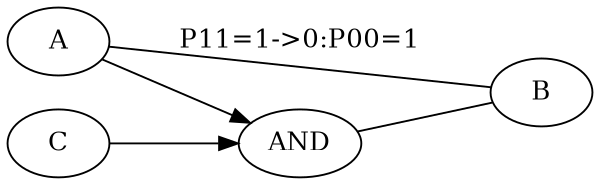
<p align="center">
図31 ANDノード形成
</P>

### ORノード

$P^{00}$ に対してフィードバックが行われたら、その場合は条件ノードCをORで結合する。

$$A \rightarrow B \quad
\begin{cases}
P^{11}=1 \\
P^{00}=1 \rightarrow 0.7
\end{cases}
$$

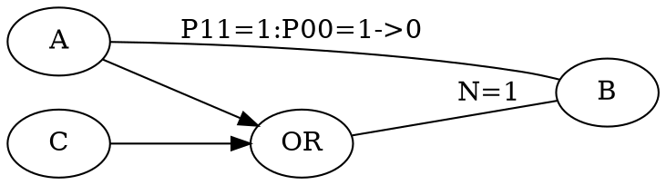
<p align="center">
図32 ORノード形成
</P>

### XORノード

$P^{11}$,$P^{00}$ 双方に対してフィードバックが行われた場合は、リンクはランダムとなり、基本的には無効となる。ただし、２つのリンクで $P^{11}$,$P^{00}$ のフィードバックが同時に行われた場合は、XORノードでの結合の候補となる。

$$A \rightarrow B \quad
\begin{cases}
P^{11}=1 \rightarrow 0 \\
P^{00}=1 \rightarrow 0
\end{cases}
$$

$$C \rightarrow B \quad
\begin{cases}
P^{11}=1 \rightarrow 0 \\
P^{00}=1 \rightarrow 0
\end{cases}
$$

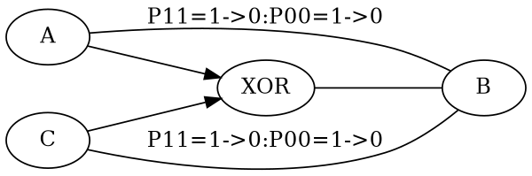
<p align="center">
図33 XORノード形成
</P>

### NOTリンク

$P^{11}$, $P^{00}$ の双方の伝搬確率が0付近となる場合は、NOTリンクとなる。

$$\neg X \rightarrow Y \quad
\begin{cases}
P^{11}=0.01 \\
P^{00}=0
\end{cases}
$$

<a id="7_2"></a>

##  7.2 「因果」フィードバックからのリンクノード活性化

以下のリンクへのフィードバックが発生した場合、リンクの前後のノードA,Bから、リンクノードが生成される。

$$ A \rightarrow B$$

### リンクノードと等価な論理演算

AからBへのリンクにフィードバックされた結果、活性化されるのはリンクノードLとなる。AからBへのリンクをLを用いた論理演算に書き換える。すなわち、リンクノードLの正体は、リンクに挿入されるAND演算に対する新規の入力ノードである。$P_A=1$に対して$P_B=1$が$P_B=0$に変化した場合は論理演算AND$\land$を挿入する。

$$ B=A \land L$$

となる。$P_A=0$に対して$P_B=0$が$P_B=1$に変化した場合は、OR論理演算$LOR$を挿入する。

$$B=A \lor L$$

さらに、$P=1$と$P=0$双方に対する変動がフィードバックが観測された場合は、XOR論理演算$\oplus$によるリンクノードを実装できる。リンクノードとXORの入力とは便宜上NOTリンクで結合される。

$$B= A \oplus \neg L$$

活性値の衝突によるフィードバックが発生したら、リンクノードへと逆に伝播される。

### リンクの伝搬確率の確定から、リンクノードの生成へ

　ANDを用いたリンクノードへの逆伝搬の確率は以下の式になる。 $P_A$、$P_B$をリンク前後の確率をとし、$P_L$をリンクノードの確率とする。

$$	P_B=P_L P_A$$

　リンクノードに伝搬確率は以下の式になる。ただし$P_A=0$以外で定義されることに注意する。

$$	P_L=\frac{P_B}{P_A}$$

　リンクノードへの確率伝搬は、順方向の伝搬と異なり変動をそのまま伝搬することができない点に注意する必要がある。
　仮定ベクトルによる伝搬集合は、写像の逆伝搬と類似した考え方で代入で伝搬する。Aに対して伝搬された$P=1$と$P=0$の２つの伝搬集合を合成して、リンクノードへと伝搬する。写像の逆伝搬と同じように、$P=0$のときのリンクノードへの伝搬確率は不定であるが、リンクノードに伝搬された仮定ベクトルが等しい伝搬確率を持つリンクに対して代入を行う。

　さらに、XORの逆方向伝搬からリンクノードへの伝搬確率を求める。まずは、XORの論理演算の式を用いる。

$$	P_B=P_LP_A+(1-P_L)(1-P_A)$$

$$	P_L=\frac{P_A+P_B-1}{2P_A-1}$$

　この式は、$P_A$,$P_B$の確率が同じならば1に、相補的ならば0になる($P_A\neq 0.5$であることが条件）。

<a id="7_3"></a>

## 7.3 「代入」　伝搬集合的に包含関係にあるノード間の結合
　
　ここで言う代入とは、複数の写像ノードに到達したそれぞれの活性値に対して、それぞれの仮定ベクトルが包含関係であることが確認できたら、写像ノードの間で活性値全体の伝搬を行うことである。

<p align="center">

</P>
<p align="center">
図34 仮定ベクトルによるステート間の代入
</P>

　図では複数のStateの間で代入が行われている。この代入の成立条件を説明する。

localstateノードは値Aの集合を包含しているが、それ以外の部分が不確定である。localstateノードの値aに対して、functionstateノードは値Aを包含する集合Xを持つため、functionstateノードはlocalstateノードを包含すると見なしても矛盾がない。そのため、functionstateノードはresultノードを部分状態として包含する。

　resultノードは、localstateノードには無いものであるが、localstateノードの未定義部分に存在すると推定しても矛盾がないと考えられる。このresultは、次の「インスタンス化」でlocalstateノードに対して追加が可能になる。これが関数によるステートへの値の代入である。

<a id="7_4"></a>

## 7.4「インスタンス化」伝搬部分集合によるネットワークの一部のインスタンス複製

ネットワークの一部を縦に分割して部分集合をとり、簡略化されたネットワークをインスタンスとして生成する。インスタンス化で生成されたリンクは、既存のリンクと構造的には変わらないが、多数のリンクの出力の選択が省略できる。

このインスタンス化を行うのは、起点の部分集合と終点の部分集合の間で、同じ伝搬集合に対する伝搬確率が定まったときであり、その経路のネットワークの伝搬集合がORなどで大きくなっているものである。起点と終点の間の経路全体を伝搬集合で分離する。

入力されたStateに対して、関数の結果の値をStateに加えるような目的に用いることができる。


<p align="center">

</P>
<p align="center">
図35 ネットワークの部分インスタンス化
</P>

<a id="7_5"></a>

## 7.5「一般化」 伝搬部分集合によるネットワークの一部の一般化複製

成立したネットワークの一部に対して、起点の包含集合と終点の包含集合同士で、より集合的に一般化されたネットワークとして複製する。これが一般化である。インスタンス化と類似しているが、ネットワークの伝搬集合が完全に観測されていない時点でも実行される。つまり、これは暫定的なネットワークであり、後にフィードバックによって修正される。

XはAを包含する一般化ノードである。YはBを包含する一般化ノードである。この時点ではXとYとの間の関係は未確定とする。XからYへの経路の一般化を行うのは、A,Bが0で活性化されていても、X,Yの別の要素C,Dをを用いてXからYへの伝搬が確定したときである。このとき、起点Xと終点Yの間の経路全体を分離する。その際に、Xの部分集合であるAと、Yの部分集合Bはそれぞれ変数V,Wノードに置き換える。

ここで注意すべきは、XとYのそれぞれの内部の部分集合A,CとB,Dに対して、どんな組み合わせ同士でも伝搬が確定するわけではないという点である。たとえば、AからDへの伝搬は観測されていないので成立しない。

一般化ノードX、一般化ノードYはORノードのこともあるが、互いに排他的なノードを意味するExclusiveノードを使用することも多い。

<p align="center">

</P>
<p align="center">
図36 ネットワークの部分一般化
</P>

<a id="7_6"></a>

## 7.6「選択」 多数のリンク伝搬の選択制御

あるノードの入出力として、大量のリンクが接続される可能性がある。とくに、関数間の接続などでは、リンクの数は千以上になりうる。そのため、探索時間の最小化の為には、リンク伝搬の選択制御を行い、必要なリンクだけに対して伝搬する必要がある。ここで問題となるのは、それらの大量のリンクは本来は伝搬確率が確定的であり、論理演算によるリンク制御を行うと伝搬確率が変動して不確定になる。この問題を解決するために、論理演算による制御とは別にリンク選択ノードを生成する。

リンクの選択は、リンク選択ノードを活性化する。この活性化されたリンク選択ノードとそれ以外のネットワークの変動状態とを変動連想で連結していく。この結果、ネットワークのステートに対応した適切なリンクの選択が可能になる。

リンク選択ノードは、SOLのネットワークそのものの部分集合を連想対象とすると考えることもできる。

<a id="7_7"></a>

## 7.7「収斂」ネットワークの最適化

２つの経路と確率とが一致するポジティブフィードバックが発生すると、伝搬集合的に小さくかつ観測数が大きくないネットワークの経路のノード、リンクは削除される。SOLのネットワークの最適化に用いられる。ネットワークの複製に対する逆の作用であり、利用されないネットワークに対して行われる。

```
   (A&(B|C)&D)|(A&(B|C)) = (A&(B|C))
```


<a id="7_8"></a>

### 7.8 SOL全体動作

SOL全体は、これまでのアルゴリズムを利用して以下の手順で動作する。


1. 初期活性化状態生成
2. **while** 全体ループ **do**
   1. 活性化されたノードを１つ選択
   2. **if** 入力不足 **then**
      1. 入力に仮定ベクトル要素追加
   3. **end if**
   4. 仮定ベクトルを用いた確率の衝突判定
   5. **if** 確率衝突検出 **then**
      1. フィードバック実行
      2. **if** リンクエントロピー増大 **then**
         1. 条件形成
      3. **else**
         1. 連想形成
         2. リンクノード活性化
   6. **else**
      1. インスタンスネットワーク生成
      2. 一般化ネットワーク生成
   7. **end if**
   8. 組み込み関数実行
   9. **while** 出力リンクループ **do**
       1. リンク伝搬
       1. 論理演算実行
   10. **end while**
3. **end while**

<div style="page-break-after: always;"> </div>

<a id="8"></a>

#  8 順序回路生成

写像によるステートを階層的に用いることにより、一般化されたステート間の回路を自律生成する。さらにステートを変数などで一般化することにより、汎用的に利用できる関数を生成する。

<a id="8_1"></a>

## 8.1 観測関数

状態観測関数は、観測した現在時間$T_n$と、同時に観測された結果A,B,Cとの連想を形成する。現在の時間に同時に観測された結果同士がさらに因果関係として写像で連結され、それらの間の論理的な関連が観測される。

<p align="center">

</P>
<p align="center">
図37 観測
</P>

<a id="8_2"></a>

## 8.2 状態遷移生成

　時系列の状態遷移は、時間を差分としたときの写像から形成される。時刻$T_n$に対するA,B,Cと、時刻$T_{n+1}$に対するDとの間の写像がフィードバックされて、A,B,C,Dの間の論理回路が形成される。

<p align="center">

</P>
<p align="center">
図38 写像による順序回路
</P>

<a id="8_3"></a>

## 8.3 一般化ノードから関数生成

A,B,resultなどの観測されたノードの間で形成された写像は、リンクへの$P^{00}$へのフィードバックにより拡大されて抽象的なノードに変化する。たとえは値Aが「一般化」されて変数X1となる。同様に値Bが一般化されて変数X2となる。こうして一般化されたX1,X2,outの間の連想こそが関数と予想される。なお、個別のA,B,result同士の関連は別の写像で表現し、この別の写像を関数で選択する。

<p align="center">

</P>
<p align="center">
図39 写像による関数
</P>

<a id="8_4"></a>

## 8.4 関数実行

一般化で形成された関数は、入力値を持つステートを代入する。関数は代入されたステートよりも伝搬集合的に大きいとみなされるため、関数の結果の値も入力ステートに含まれるとみなす。これがステートへの関数の適用である。そして適用された結果は、インスタンス化で部分的に複製されて元のステートに追加される。

結果ノードへのフィードバックが発生すると、結果を生成した関数に対しても再帰的にフィードバックが適用される。

<p align="center">

</P>
<p align="center">
図40 関数の適用
</P>

関数の結果は、一致を示すリンクノードも用いることができる。すなわち一致判断をBooleanに変換する条件判断も実装が可能になる。

<a id="8_5"></a>

## 8.5 関数のグループ化

生成された関数を連続適用する方法を示す。関数fと関数gとを連続適用するために、f出力とgの入力とを接続するネットワークを追加する。

<p align="center">

</P>
<p align="center">
図41 関数のグループ化
</P>

関数を条件次第で連結するように、関数fの出力に条件とANDノードを挿入して、関数gの入力に接続する。この条件を別の関数の結果とすることにより、再帰を含むあらゆる関数の組み合わせを実現できると考えられる。

<a id="8_6"></a>

## 8.6 組み込み関数とその利用

組み込み関数とは、入力ノードと外部の観測を用いて、出力ノードを選択して活性化する外部関数と定義する。入力に対する作用は組み込み関数の内部で定義する。SOLの外部との入出力にも利用できる。組み込み関数で用いられるノードはBoolean値であるが、組み込み関数はノードに対応する実際のオブジェクトを取得することができる。具体的にはIntegerなどのスカラ値、ベクトル値、オブジェクトなどを対応させて、組み込み関数が演算に利用する。結果はスカラ値などに相当するノードをその都度生成して、入力ステートと条件付きで結合させる。

中間値を持つスカラ値に対してフィードバックを行いたい場合は、確率とは無関係なフィードバック手段を用いる必要がある。他にもベクトル値などは確率だけでは管理が出来ない。そのため、中間値を持つ値などはSOLのフィードバックとは別の機構を用意して実現することになる。例えばフーリエ級数やガウシアンノイズなどの生成関数や、これらを統合する加算や内積演算なども組み込み関数として提供する。これらの組み込み関数の選択と接続は、SOLの写像や関数などで実現可能である。

以下の図の例では文字Tokenの持つ実数ベクトル値を用いて、内積を組み込み関数で計算してResultの値を生成し、相当するノードを生成している。

<p align="center">

</P>
<p align="center">
図42 組み込み関数
</P>

<a id="8_7"></a>

## 8.7 機械学習のAttentionとの対比

近年広く用いられているTransformerの基礎となるAttention[2]は、機械学習において目覚ましい成果を出している機構である。この機構はこれまでの論理回路には無い応用力がある。だがこの機構は発見的なもので理論的な整合性が取れていない。

<p align="center">

</P>
<p align="center">
図43 Attentionの機構とSOLの関数との類似点
</P>

AttentionのKQVはいずれも文字などのトークンに相当するN次元ベクトルである。これに対して、SOLのステートは、制限のない階層的データ構造である。

AttentionのKとQとの内積演算による比較は、SOLの関数における入力条件と入力ステートとの比較に対応する。SOLの入力Stateの部分状態がAttentionにおけるQueryであり、SOLの関数の比較部分がAttentionにおけるKeyとなる。その結果、AttentionのValueのように元のStateが関数に代入されて、部分改変が行われる。SOLの関数の出力条件となる論理演算は、AttentionのValueに対する改変作用と対比できる。

以上のように、SOLの写像とステートによる関数は、Attentionの機構と対比が可能である。むしろSOLの関数の方がAttentionの機構をより一般化して定性化したものと考えられる。

<div style="page-break-after: always;"> </div>
<a id="9"></a>

# 9 結論

以上の内容を統合して要約すると、この自己組織化論理は以下の特徴を持つ。

1. 双方向論理は、集合間の論理演算に逆伝搬を適用することで写像の概念を実現する。写像を用いれば、時空間の重複がない任意の集合同士の関連を表現できる。これにより、順序回路が論理回路だけで記述できる。

2. 論理ノード間の接続リンクに$P^{11}$、$P^{00}$の二項組の伝搬確率を設定し、リンクの双方向伝搬を可能にすることで、双方向二項確率ベイジアンネットワークとなる。逆伝搬はベイズの定理そのものとなる。写像を通過した双方向伝搬は、任意の２つの集合間の厳密な伝搬確率計算を可能にする。

3. 仮定ベクトルによる集合確率伝搬は、リンクや写像を通過する伝搬部分集合を仮定ベクトルで厳密に管理し、仮定ベクトルの部分一致や差分を用いることで、関連のある任意の２つのノード間の集合包含関係を算出できる。複数の確率伝搬が同一ノードで衝突した際に、双方の仮定ベクトルが一致した場合、確率の一致、不一致に応じて双方のパスにフィードバックを行う。特に不確定リンクを確定値へとフィードバックする場合は一致を示すリンクノードを活性化させる。

4. 双方向二項確率ベイジアンネットワークは、リンクの過去の伝搬確率と観測回数とに基づき、確率変動分配階層フィードバックアルゴリズムを使用することで、自動的にすべてのリンク伝搬確率を正確にフィードバック補正する。

5. 連想は、同時に変動が観測された集合的に排他的なノード同士を確率的に結合して写像にする。連想の対象は観測された値だけではなく、フィードバックで発生した論理演算の条件ノードも同様に連想対象となる。この作用により、どのような部分集合の間でも連想を形成することができる。

6. 確率的自律論理生成アルゴリズムは、連想で結合されたリンク確率へのフィードバック結果に応じて、論理演算と写像とを追加することによって、確率100%あるいは0%の確定的デジタル論理を自動的に追加生成する。$P^{11}$、$P^{00}$のペアの伝搬確率を用いることで、論理演算の正確な挿入が可能になる。その際に、ネットワークを部分複製して論理演算を追加する。$P^{00}$の変動などでは、ネットワークを部分複製して一般化を行うことも出来る。

7. 時間に対する値の変動に対して連想を形成し、連想へのフィードバックに対してさらに論理演算を追加していくことにより、メモリなどの入力と出力の間で一般化された論理回路を生成することが可能になる。更に、ネットワークの一般化複製を行うことにより一般的な順序回路が自律形成されていく。一般化された順序回路は何度も利用されて関数となる。

8.  写像を階層的に用いれば、一般的なソフトウェアの階層的なデータ構造と関数とを表現できる。これらの写像の間で伝搬集合の包含関係を管理することにより、データ構造を持つステートに対してパラメータの一致を判定して、関数の結果をステートに追加複製することができる。そのためにSOLで定義した写像間の「代入」と「インスタンス化」を用いる。

このSOLは確率、集合、写像などの数学的な基本原理のみに基づいて構築されている。生物のニューロンの模倣は行っていない。さらに、ニューラルネットワークの非線形活性化関数のような厳密ではないヒューリスティックスはほとんど使用していない。そのため、一般的な機械学習よりも厳密な数学理論に近いものであり、自律生成ソフトウェアがこのSOLの延長線上にあることはほぼ確信できる。ニューラルネットワークなどの既存の機械学習も、このSOLの一部の近似的な実装であるとすら考えられる。そのため、正確で安全な機械学習を目指すならば何らかの形でこのSOLの原理を導入するしかない。

実装による動作の実証、実装の効率化、簡略化、並列化などが今後の課題となる。また、SOLが論理回路やソフトウェアを網羅的に自律生成ができるかどうかも、今後の研究課題になるだろう。

SOLは、数理論理学や圏論等との関連も明白なので理論の一般化の余地がある。

<div style="page-break-after: always;"> </div>
<a id="glossary"></a>

## Glossary　用語集
### SOL(Self-organizing Logic)

論理回路に相当するノードと二項確率を持つリンクとで構成される双方向ネットワークを自動生成するシステム

### 値ノード	(value node)

論理演算の起点となる値に相当する。仮定によって活性化され、仮定ベクトルの起点となる。リンクで接続された論理演算からの逆伝搬も仮定の一種となる。

### 論理演算ノード(logic node)

複数の入力リンクの確率に対して論理演算を行い、出力リンクに結果となる確率を出力する。論理演算を行うと同時に、仮定ベクトルも合成する。

### 接続ノード	(joint node)

複数のリンクの入力をそれぞれそのまま出力する。入力間では確率演算は行わない。

### 関数ノード	(function node)

リンクの入力に対して外部関数を実行して、結果ノードを活性化する。

### リンク	(link)

ノードの間を二項組の伝搬確率で結合する。確率を入力して確率を返す。逆方向の確率も別に定義する。

### リンクノード	(linknode)

リンクの伝搬確率がフィードバックによって変動した際に、リンクに相当するノードを生成してリンク前後の値の比較結果を伝搬する。具体的には2入力のANDノードやXORノードの入力逆伝搬に相当する。リンクの伝搬前後の確率が等しい場合はリンクノードに1が伝搬される。リンクの伝搬前後の確率が一致しない場合はリンクノードに不確定値（0と1との間の値)が伝搬される。

### リンク選択ノード	(link selection node)

特定のリンクの伝搬を選択するためのノード。個々のリンクに対してそれぞれ選択ノードが存在する。このノードを活性化することにより、該当するリンクを優先的に選択する。

### SOLネットワーク	(SOL network)

ノードとリンクから構成され、確率を伝搬するベイジアンネットワークの一種である。リンクには伝搬確率の重みがあるため、定義上グラフではなくネットワークとなる。論理演算ノードの存在と、論理演算の伝搬方向が双方向であるという点が特徴的である。

### 写像	(map)

写像を示すノードから、複数の部分集合ノードがリンクと条件ANDノードとを経由して連結される。この部分集合ノード同士の関係を一般的な写像とみなす。

### 仮定ベクトル 	(assumption vector)

特定のリンクの確率値を0と1のどちらかで仮定する。実値ノードへの暗黙の入力リンクを仮定することで伝搬起点となる。この仮定が複数集まって二値のベクトルとなる。論理演算で複数の仮定ベクトルが統合される。結合ノードで複数の仮定ベクトルが比較され、仮定ベクトルに重複があればフィードバックが実行される。

### 伝搬	(propagation)

リンクを通過して確率値を伝搬する。伝搬するのは常に起点からの確率値であり0から1の間の値となる。同時に仮定ベクトルも伝搬する。

### 逆伝搬	(reverse propagation)

論理演算の入力リンクを逆にたどる作用。論理演算によっては仮定ベクトルの統合が行われる。

### 伝搬集合	(propagating set)

ネットワークのノード、リンクを通過する断面に対する部分集合であり、仮定ベクトルだけで決定される。ノードの論理演算で作られる集合とは無関係となる。

### 活性値 	(activation value)

ネットワークのノード、リンクを通過する活性化状態であり、伝搬集合と伝搬確率で構成される。

### フィードバック	(feedback)

ネットワークの双方向確率伝搬で、同一起点から同一終点へと２つの別の経路で到達したとき、２つのパスの伝搬確率と仮定ベクトルとを比較する。仮定ベクトルが重複していて、さらに伝搬確率が同一でない場合は、フィードバックによって２つのパスの伝搬確率が同一になるように補正する。その際に、観測数の少ない不確定なリンクを優先的にフィードバック補正する。

### 効果係数 (effect coefficient)

リンクの変動が、リンクが伝搬された結果に対してどのように作用するかを示す。具体的には、あるリンクの伝搬確率が０から１へと変動した場合、ネットワークの伝搬先の確率が確実に１に変動する場合は効果係数１となる。それに対して、リンクが０から１に変動しても、例えば途中でOR演算などを通過していたら末端の確率は変動しない。この場合は効果係数が０になる。

### ウェイト (weight)

個別のリンクの変動が、リンクが伝搬された結果に対してどの程度作用するかを示す値である。リンクの伝搬確率($P^{11}$あるいは$P^{00}$の値)が0か1に近ければウェイトは0に近く、伝搬確率が0.5に近ければウェイトは最大になる。リンクのフィードバック回数が多ければウェイトは減少する。

### 変動連想	(association between fluctuations)

観測値が同時に変動したノード同士を写像で連結する。同時の変動とは、具体的には仮定ベクトルの同じ要素の変動前後の確率値がそれぞれ観測されたことを意味する。

### 代入 (substitution)

同じ仮定ベクトルが到達した複数のノード同士を仮想的に包含関係とみなす作用。たとえパラメータなどの部分的な一致が確認されただけでも、矛盾がなければノードの集合全体が関連があるとみなす。

### インスタンス化  (instantiation)

ネットワークの一部をインスタンスとして複製する。伝搬集合が確定した部分だけを抽出するので中途の論理演算の一部が省略される。

### 一般化	(generalization)

ネットワークの一部を一般化して複製する。観測されたノードよりも集合の大きなノードを用いたネットワークを生成する。伝搬集合の大きなノードはまだ一部だけしか観測されていないため、この時点では確率的に不確定である。

### 組み込み関数 (embedded function)

SOLの外部との入出力を行うために用意される。入力への確率伝搬で動作を開始して、入力に相当する実値ノードを使用して、結果に相当する実値ノードに確率を伝搬する。数値計算などもこの組み込み関数で実行される。

<div style="page-break-after: always;"> </div>
<a id="references"></a>

# 参考文献
[1] Artificial Intelligence A Modern Approach
  Stuart Russel, Peter Norvig

[2] Attention Is All You Need
Ashish Vaswani, Noam Shazeer, Niki Parmar, Jakob Uszkoreit, Llion Jones, Aidan N. Gomez, Lukasz Kaiser, Illia Polosukhin
